# 1.爬虫基础1

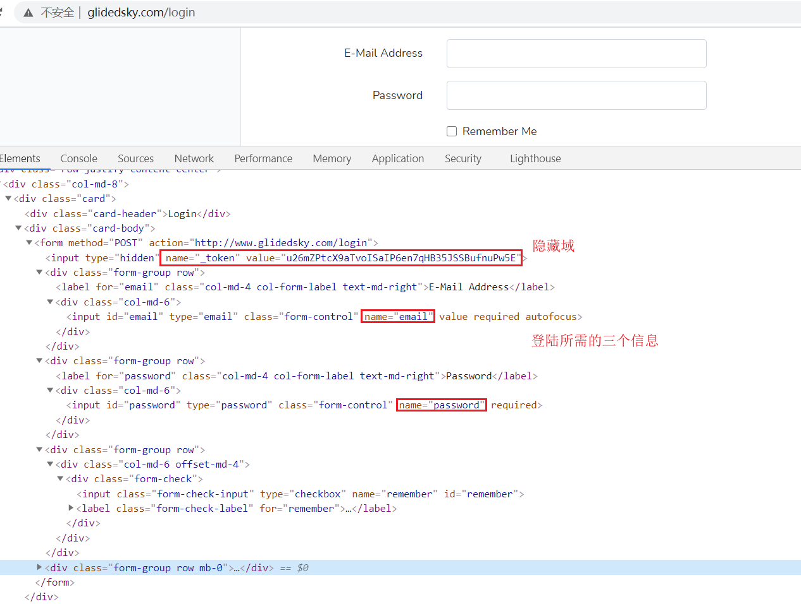

其次，关于`_token`，新开浏览器(无痕)会发现这个值是会变化的


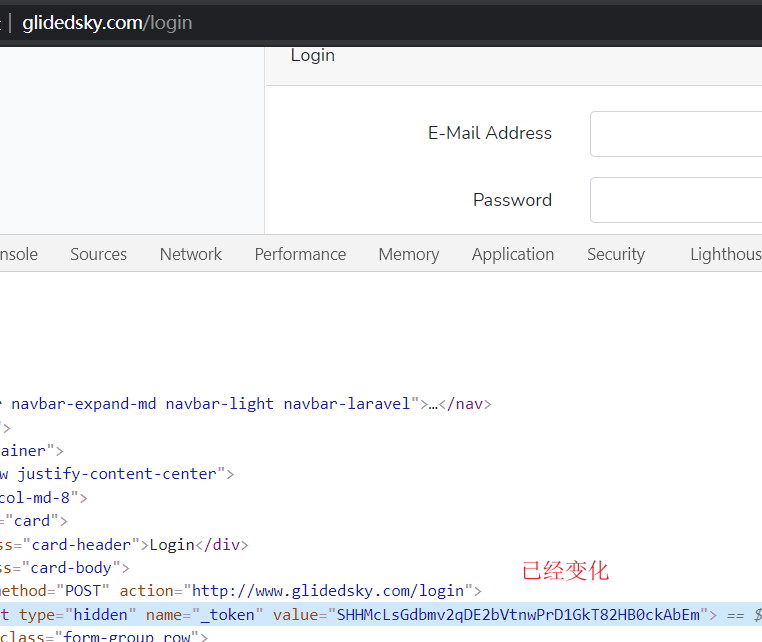

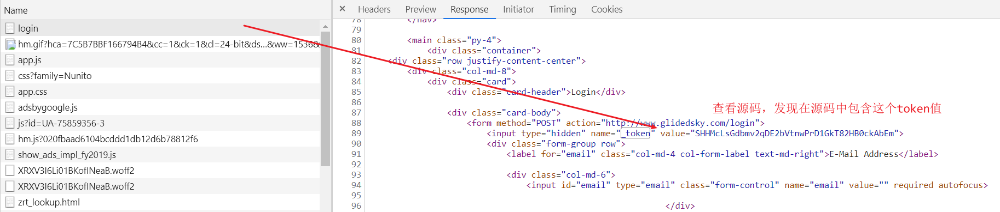


思路：每次请求前先访问登陆界面获得token，再和email、password一起请求。这是一个公共的过程，封装成 env.py。

```python
"""
环境设置
"""
import requests
import re


class Env(object):
    # 每秒获取个数 最多200 但是靠后的因为时间关系 多少会速度差些
    ip_each = 30
    # 请求数据
    login_data = {
        "email": "邮箱",
        "password": "密码",
        "_token": ""
    }
    # api的url
    proxy_api_url = "api_url xxx &getnum=" + str(ip_each)

    def __init__(self):
        # 请求头
        self.headers = {
            "User-Agent": "Mozilla/5.0 (Windows NT 10.0; Win64; x64) AppleWebKit/537.36 (KHTML, like Gecko) "
                          "Chrome/89.0.4389.90 Safari/537.36 "
        }
        # login_url
        self.login_url = "http://www.glidedsky.com/login"
        # 使用session, 自动保存登陆后获取的cookie
        self.session = requests.session()

    # 登陆获取 _token值
    def login(self):
        response = self.session.get(self.login_url, headers=self.headers)
        # 正则解析, 将_token值返回
        self.login_data["_token"] = re.search('name="_token" value="(.*?)"', response.text).group(1)
        # 登陆数据齐备, 正式登陆
        self.session.post(self.login_url, data=self.login_data, headers=self.headers)
        # print(self.login_data["_token"])
        return self.session

    """
        实时获取代理ip: 某宝找的1块测试, 1s最多获取200次api 这里获取60 感觉前面的速度快些
        ['ip1:port1', 'ip2:port2']
        过期后用的华益云 ip数量计费
    """
    def get_proxy(self):
        response = requests.get(self.proxy_api_url, self.headers)
        return response.text.split("\r\n")


if __name__ == '__main__':
    env = Env()
    # env.login()

    print(env.get_proxy())
```


## 第一题

```python
"""
爬虫基础1
"""
from env import Env
from lxml import etree

# 调用封装的登陆环境
env = Env()
session = env.login()

# 有了token, cookie等信息, 就能访问爬虫一页面了
url = "http://www.glidedsky.com/level/web/crawler-basic-1"
response = session.get(url, headers=env.headers)
# 获取每一个数字框
html = etree.HTML(response.text)
div_list = html.xpath('//div[@class="col-md-1"]')
# 定义 和
total = 0
for div in div_list:
    total += int(div.xpath('normalize-space(./text())'))

print(f"结果是: {total}")
```


# 2.爬虫基础2

登陆同上，这次需要翻页，这就需要循环获取下一页的链接。

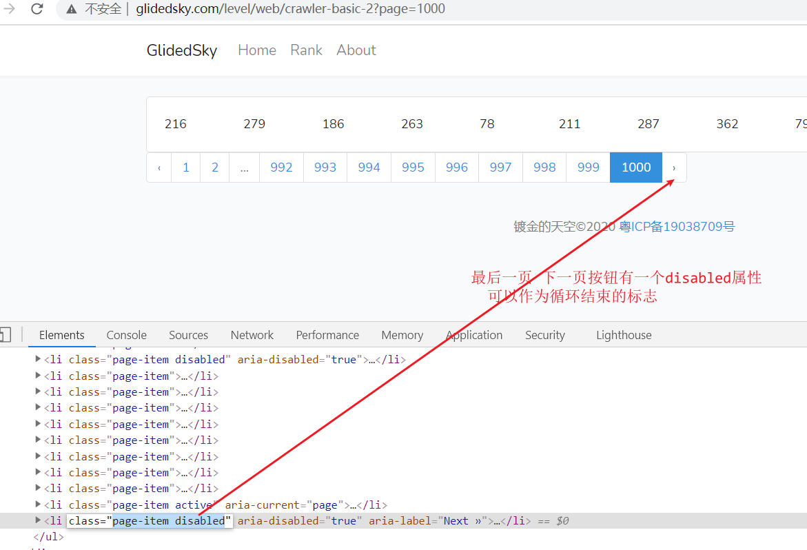


每一页获取数据方式同`爬虫基础1`，只是xpath语法有差别。

```python
"""
爬虫基础2
"""
from env import Env
from lxml import etree
import re

# 调用封装的登陆环境
env = Env()
session = env.login()

# 定义 和
total = 0
# 这次需要循环遍历每一页
curr_page_url = "http://www.glidedsky.com/level/web/crawler-basic-2?page=1"
while True:
    response = session.get(curr_page_url, headers=env.headers)
    # 获取每一个数字框
    html = etree.HTML(response.text)
    div_list = html.xpath('//div[@class="card-body"]//div[@class="col-md-1"]')

    for div in div_list:
        total += int(div.xpath('normalize-space(./text())'))

    cur_page_num = re.search('page=(\\d+)', curr_page_url).group(1)
    print(f"前{cur_page_num}页数字和为: {total}")

    # 是否还有下一页
    next_page_btn = html.xpath('//ul[@class="pagination"]/li[last()]')[0]
    # 如果下一页按钮有disabled样式, 就没有下一页
    if next_page_btn.xpath('contains(@class, "disabled")'):
        break
    else:
        # 有下一页, 给下一页url赋值
        curr_page_url = next_page_btn.xpath('./a/@href')[0]

print(f"结果是: {total}")
```


# 3.IP屏蔽1

先用奇怪的方法达到修改ip的目的，再进去查看下网页结构，把xpath先行记录一遍，后续有错再改。（代理获取网页内容也可）

结果是：页面结构和爬虫基础2相同。

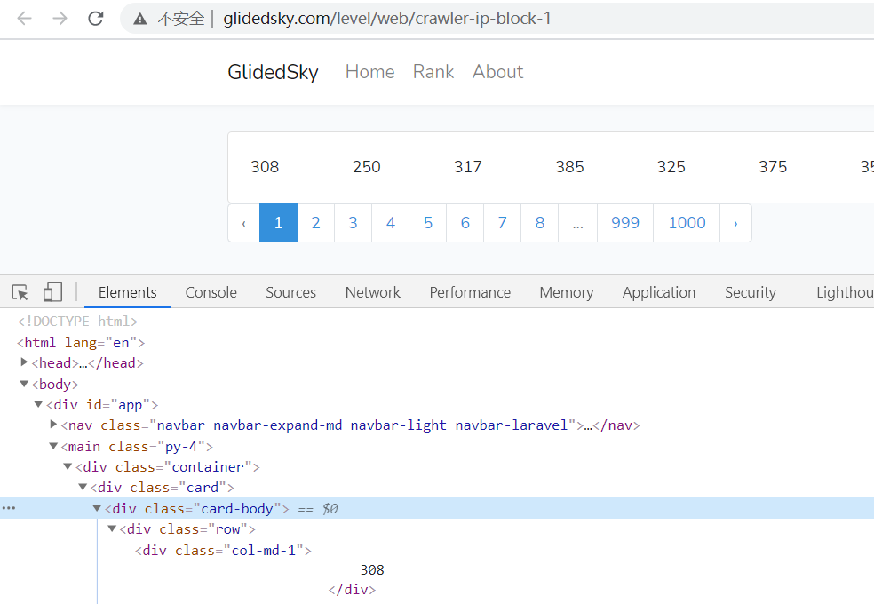


现在最重要的就是如何获取1000多个可用的代理ip了，我们去某宝随便找一个便宜的`高匿ip`。

在env.py的Env类中添加如下成员方法：

```python
	# 每秒获取个数 最多200 但是靠后的因为时间关系 多少会速度差些
    ip_each = 30
    
    # api的url
    proxy_api_url = "api_url" + str(ip_each)
        
    """
        实时获取代理ip: 某宝找的1块测试, 1s最多获取200次api 这里获取60 感觉前面的速度快些
        ['ip1:port1', 'ip2:port2']
        过期后用的华益云 ip数量计费
    """
    def get_proxy(self):
        response = requests.get(self.proxy_api_url, self.headers)
        return response.text.split("\r\n")
```

现在将上个`爬虫基础2`的代码进行改造，添加每次更换一个代理进行请求。

```python
"""
ip反爬1
    结构和爬虫基础相同
"""
from env import Env
from lxml import etree
import re
import time

# 调用封装的登陆环境
env = Env()
session = env.login()

# 定义 和
total = 0

# 当前页
curr_page = 1

# 代理ip的索引, 因为每1秒只能获取最多200个ip
proxy_index = 0

# 200个代理ip列表
proxy_list = env.get_proxy()

while True:
    # 这里采用代理 超时设置为0.6s 设置小一点 那么慢的代理ip就自动跳过了 但是又不能太小 毕竟代理比正常访问慢 跑完估计也得5-8分钟左右
    # 如果报错/返回403页面就用下一个代理 注意代理的 键是http 写成大写代理无效
    try:
        response = session.get(f"http://www.glidedsky.com/level/web/crawler-ip-block-1?page={curr_page}",
                               headers=env.headers, timeout=0.3, proxies={"http": proxy_list[proxy_index]})
        # 页面响应403 则也应算错误
        if 403 == response.status_code:
            raise Exception(f"该代理已经用过: {proxy_list[proxy_index]}")
    except Exception as e:
        # 直接使用下一个的proxy
        proxy_index += 1
        if proxy_index >= env.ip_each:
            proxy_list = env.get_proxy()
            # *****
            proxy_index = 0
        continue

    # 获取每一个数字框
    html = etree.HTML(response.text)
    div_list = html.xpath('//div[@class="card-body"]//div[@class="col-md-1"]')

    print("-"*40)
    for div in div_list:
        total += int(div.xpath('normalize-space(./text())'))

    print(f"前{curr_page}页数字和为: {total}")
    if curr_page >= 1000:
        break
    curr_page += 1

print(f"结果是: {total}")
```


# 4.IP屏蔽2

因为每次请求都是用的新代理ip，代码同 `ip屏蔽1`题。

结果（多循环了一次，curr_page >1000 之前没加上 >=，对结果没影响）：

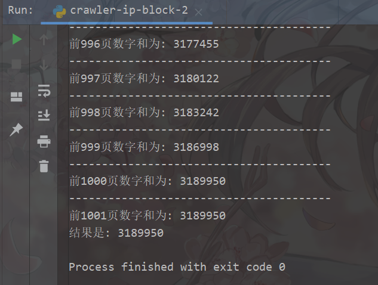


# 5. 字体反爬1

看过题并分析过html代码的应该都清除，每次刷新源码中的数字都是变化的，而实际显示出的数字都没变化。
有心的同学应该比较过每次刷新网页后的base64串的值，它们都是不同的，说明base64串在这里承载了字体转化的功能。
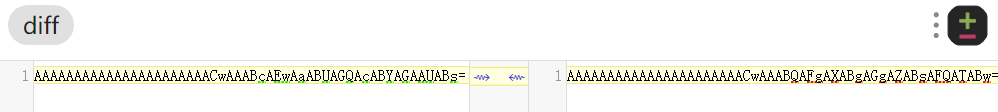
所以我们需要对每次的base64串进行分析，在这里了解到了能将base64转化为`ttf`文件，再利用代码转为`xml`文件做分析。

我们在`浏览器`内(方便后期对比确认结果)，获取base64串，用代码将其转为 ttf 和 xml 文件。


> **数据采集过程**

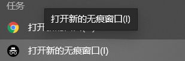
进入页面后F12，搜索`base64`，进入界面复制值。
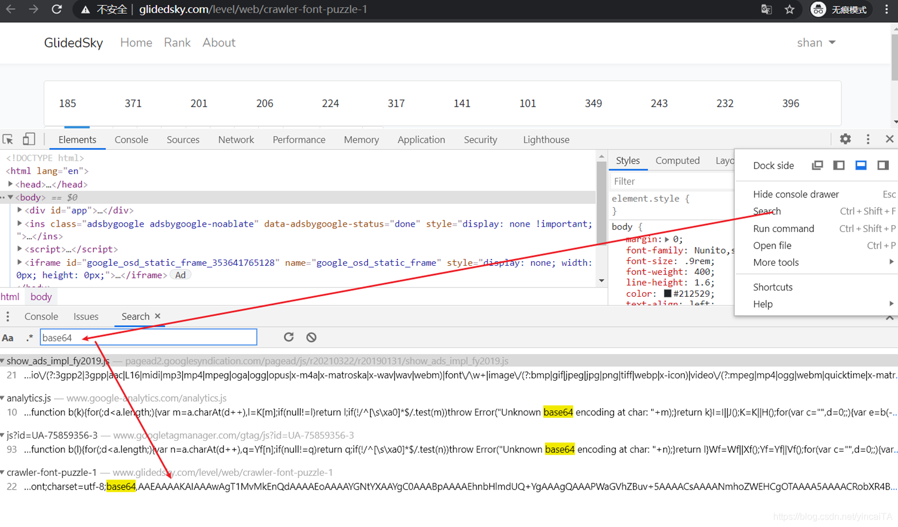
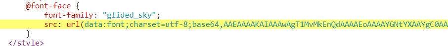
> 代码验证base64的不唯一性  并  转化ttf、xml
> **ttf_test.py**

```python
"""
关于转码
    https://blog.csdn.net/yishengzhiai005/article/details/80045042
    python2中进行Base64编码和解码
    python3不太一样：因为3.x中字符都为unicode编码，而b64encode函数的参数为byte类型，所以必须先转码。
    
测试base64转ttf、分析ttf、xml文件
"""
from env import Env
import re
import base64
from fontTools.ttLib import TTFont

env = Env()
env.login()
session = env.session

url = "http://www.glidedsky.com/level/web/crawler-font-puzzle-1"

response = session.get(url, headers=env.headers)

# base64_str = re.search('base64,(.*?)[)]', response.text).group(1)

# 打印base64 说明每次的base64都有不同之处
# print(base64_str)
# 解码(base64参数都是unicode编码后的串, 所以str先得encode), 解码针对的是base64_str编码成unicode后的bytes

# 直接用我们无痕浏览器复制下来的base64串
base64_str = "自己补全"
data = base64.b64decode(base64_str.encode())
# 现在的data依旧是unicode编码的bytes类型

# 写出为 .ttf
with open('font-puzzle-1.ttf', 'wb') as f:
    f.write(data)

# 将font-puzzle-1.ttf转为xml文件
font = TTFont('font-puzzle-1.ttf')
font.saveXML('font-puzzle-1.xml')
```


> **第一次获取base64串**

将base64串赋值到代码中变量 `base64_str`，运行生成 ttf 和 xml。
将ttf用fontstore[链接](http://font.qqe2.com/index.html)（或fontcreator）打开，
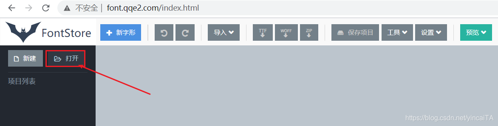

fontstore打开如下图：
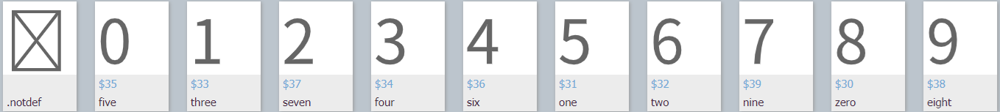
fontcreator打开如下：

我们再打开 xml 进行分析，搜索`code`相关内容，发现就只有以下2处有效数据(和数字相关的数据)。
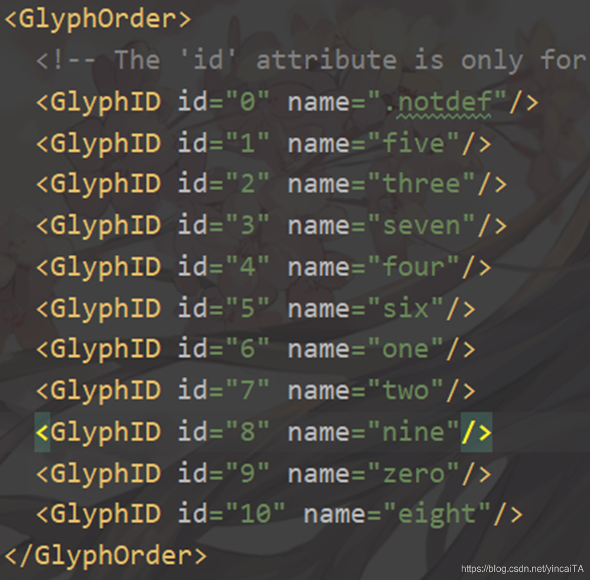
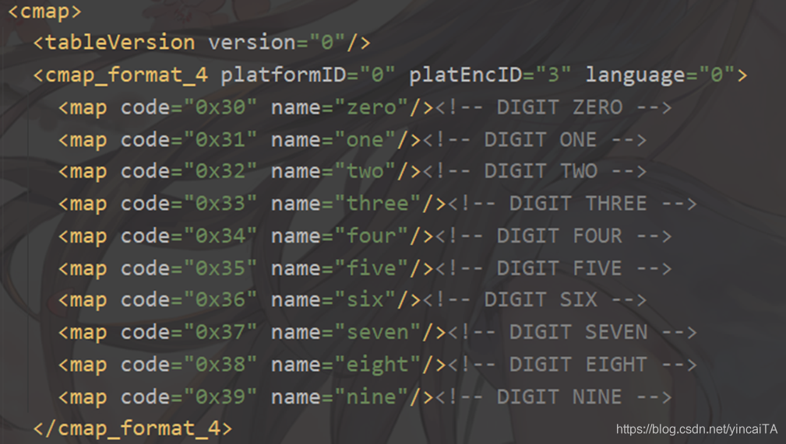
结合`xml中上面2图的映射关系`和`fontstore中的`将数据整理成表格：
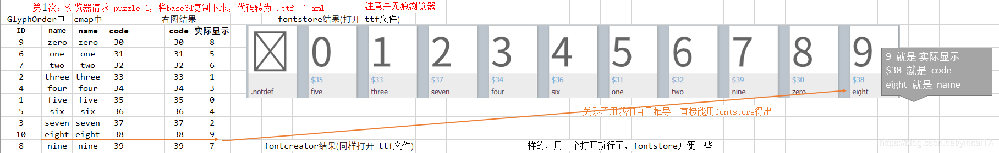
纸面分析完了，进行浏览器内容比较：
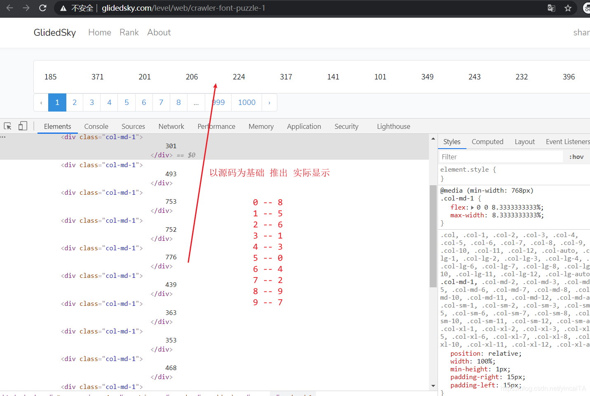

比较浏览器显示：说明字体文件（ttf/xml）中的cmap中的<font color=red>name值</font>唯一对应一个<font color=red>实际显示</font>。因为表格中，"zero" --> 8，"one"  --> 5 ......，只是我在图中用了数字表示。


> **第二次获取base64串**

重开一个无痕浏览器，进行同样访问，获得一个新base64串，用代码（ttf_test.py）重新生成ttf和xml文件，fontstore<font color=red>重新</font>打开ttf文件。

现在先就可以不用再分析xml文件内容了，经过第一次观察，直接看`fontstore结果`即可，结果是一样的。
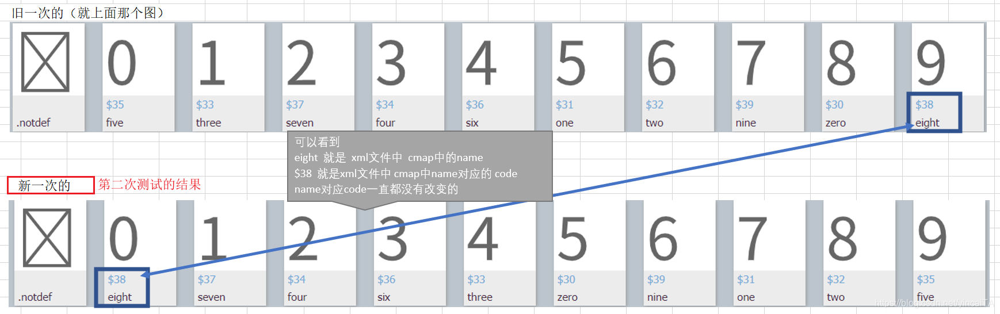
重要结论：<font color=red>name对应code一直都没有改变的。</font>所以，源码改变，但是实际显示内容不变，肯定是 `code --> 实际显示`  这一过程的映射发生了变化。正好GlyphOrder映射有所改变。
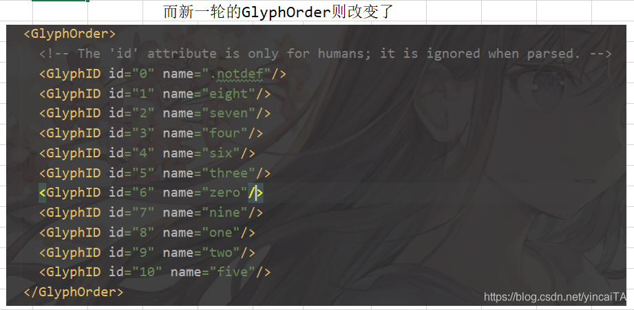
下面是新一轮统计的表格：
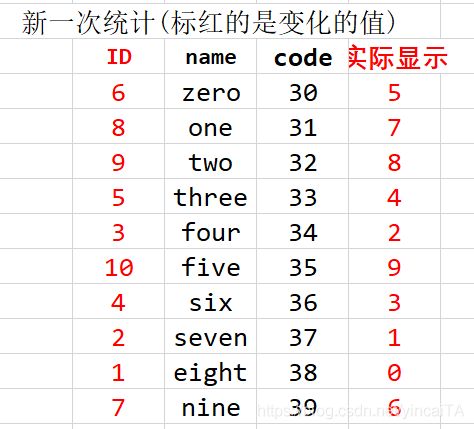
“zero” -->  5，"one"  -->  "7"，.....。


现在靠第二次纸面分析的结果，我们推测：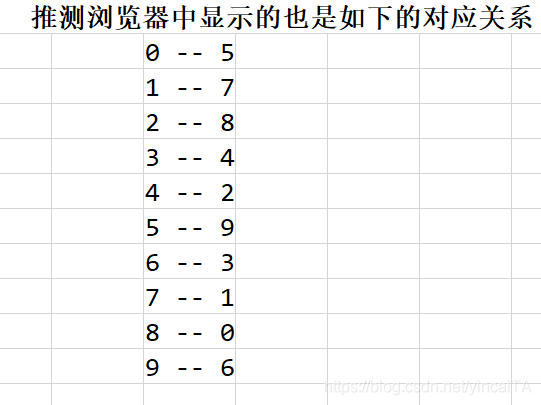


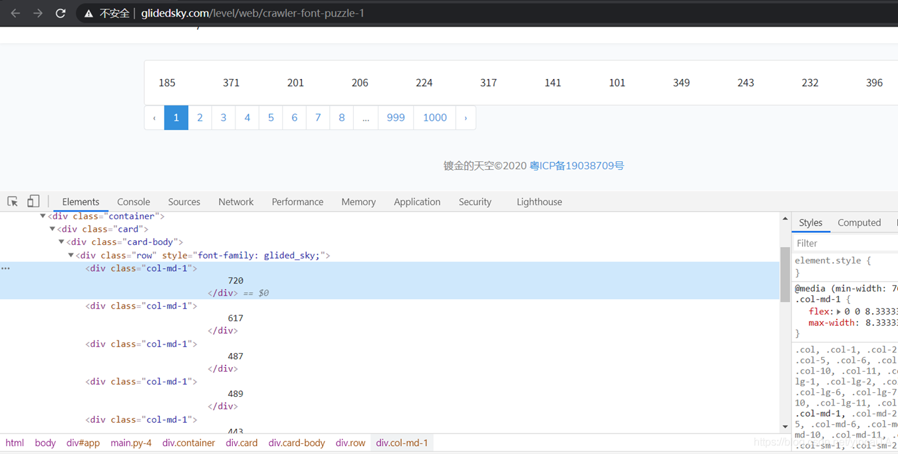

推测<font color=red>正确</font>。


> **思考**

现在我们能从xml中获取`name --> code` 的映射（这是不变的），那么 从 `name --> 实际显示` 的映射怎么办呢?

从第二次测试中能得出：实际显示的改变就和`GlyphOrder`的变化有关（即ID和name的映射的改变）。

再加上实际显示的结果，我们比较2次测试，表格结果的区别：
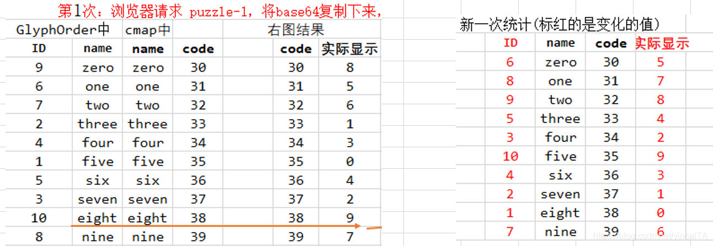
从xml文件中和`"code"`有关的部分就只有`GlyphOrder`和`cmap`，cma的name、code我们已经用了，也用了GlyphOrder中的name，还有GlyphOrder中的ID规律我们没考虑到。

我们观察上面2图，很轻松就能发现 ==**ID-1 就等于 实际显示**==


> **实现**

所以代码逻辑也有了：请求获取base64，转为tff再转为xml，lxml解析，（能构建cmap中 `name --> code`，但我们只关心`name-->ID`），再构建GlyphOrder中  `name --> ID`的映射。得到了name，**name其实就是浏览器源码中提起出来的数字，转化为ID，再减一，就成了真实数据了**。但是name中 `'zero'`需要变为`0`，方便后期直接进行页面内容转化为真实结果。


> 代码如下

```python
from env import Env
import re
import base64
from fontTools.ttLib import TTFont
from lxml import etree
import io

# 数字-英语 映射
english_map = {
    '0': 'zero', '1': 'one', '2': 'two',
    '3': 'three', '4': 'four', '5': 'five',
    '6': 'six', '7': 'seven', '8': 'eight', '9': 'nine'
}

"""
将源码中的字符串转化为真实的数字
    src_str: 如'231' --> 567  '23' --> 56  '1' --> 7
    digit_map: 源码数字 --> 真实数字 的映射 {"zero": see_num1, "one": see_num2, ...}
    返回: 真实数字
"""
def parse_srcstr_realnum(src_str, digit_map):
    # 分解出每一位字符 注意 join参数必须为字符串
    return int(''.join(str(digit_map[english_map[ch]]) for ch in src_str))


"""
获取从源码中的数字到见到的数字的映射
    返回: 当前页响应, 当前页的数字映射
"""
def get_response_and_digitmap(page):
    url = f"http://www.glidedsky.com/level/web/crawler-font-puzzle-1?page={page}"

    response = session.get(url, headers=env.headers)

    base64_str = re.search('base64,(.*?)[)]', response.text).group(1)

    # 解码(base64参数都是unicode编码后的串, 所以str先得encode), 解码针对的是base64_str编码成unicode后的bytes
    data = base64.b64decode(base64_str.encode())
    # 现在的data依旧是unicode编码的bytes类型, 转化为io流, 避免写文件过程
    fio = io.BytesIO(data)
    font = TTFont(fio)
    glyph_order = font.getGlyphOrder()
    # 数字映射 {"源码中的数字": "实际看到的数字", ...}
    digit_map = {}
    # 解析GlyphOrder中的<GlyphID id="" name=""> 并组成 {"zero": "see_num1", "one": "see_num2", ...}
    for glyph_name in glyph_order:
        digit_map[glyph_name] = str(font.getGlyphID(glyph_name) - 1)

    print('源码数字 -> 可见数字: ', digit_map)
    return digit_map, response


"""
获取当前页真实的数字和, 一次请求一页, 一页内的数字 映射不会变的
    page: 第几页数据
"""
def get_page_sum(page):
    digit_map, response = get_response_and_digitmap(page)
    # 获取每一个数字框
    html = etree.HTML(response.text)
    div_list = html.xpath('//div[@class="card-body"]//div[@class="col-md-1"]')

    # 每页和
    page_total = 0
    for div in div_list:
        # 一个数字串
        s = str(div.xpath('normalize-space(./text())'))
        # 分别解析, 如'231' -> 231
        page_total += parse_srcstr_realnum(s, digit_map)

    return page_total


env = Env()
env.login()
session = env.session

# 总和
total = 0
# 定义和
for page_num in range(1, 1001):
    total += get_page_sum(page_num)
    print(f'前 {page_num} 页和为 {total}')
```


# 6.字体反爬2

原理同`字体反爬1`，但是现在从浏览器获取的内容不是数字了，而是汉字，并且xml中camp的name值也并没有像 "zero"、"one"的提示了，所以之前存在的 english_map 现在需要由我们自己构建了，原来english_map是 "1" -> "zero" 的映射（这我们是熟知的），但现在我们需要 "源码中汉字" -> "name" 的映射。

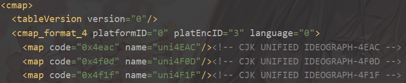


> 测试get请求获取的内容，编码前和编码后的内容，并生成ttf和xml
>
> 用浏览器能得到base64和显示情况，分析  "源码汉字"  -->  "实际显示" 的过程。

测试代码如下（test_ttf.py）：

```python
import base64
from fontTools.ttLib import TTFont

# 浏览器复制base64串 保持网页不刷新 分析同一页的数据
base64_str = "浏览器源码里复制"
data = base64.b64decode(base64_str.encode())
# 现在的data依旧是unicode编码的bytes类型

# 写出为 .ttf
with open('font-puzzle-2.ttf', 'wb') as f:
    f.write(data)

# 将font-puzzle-2.ttf转为xml文件
font = TTFont('font-puzzle-2.ttf')
font.saveXML('font-puzzle-2.xml')
```


用fontstore打开ttf文件，只分析 0 - 9。

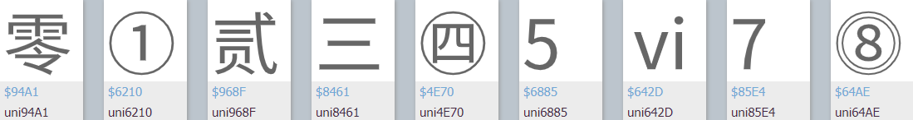

浏览器中实际显示为“零”的情况下：

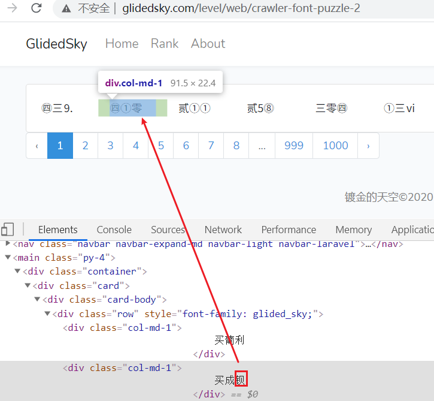

对应源码汉字为：“钡”，经过站长工具计算，“钡”的unicode编码为："\u94a1"

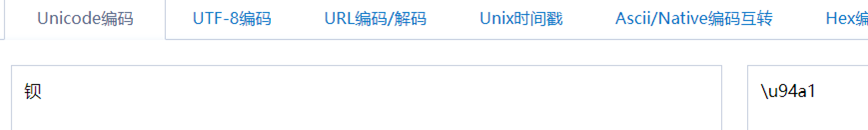

我们再在xml文件中搜索“钡”的unicode编码，结合xml中cmap的内容，我们直接搜索"uni94a1"，总共2个结果。


在浏览器中实际显示为“①”的情况下，

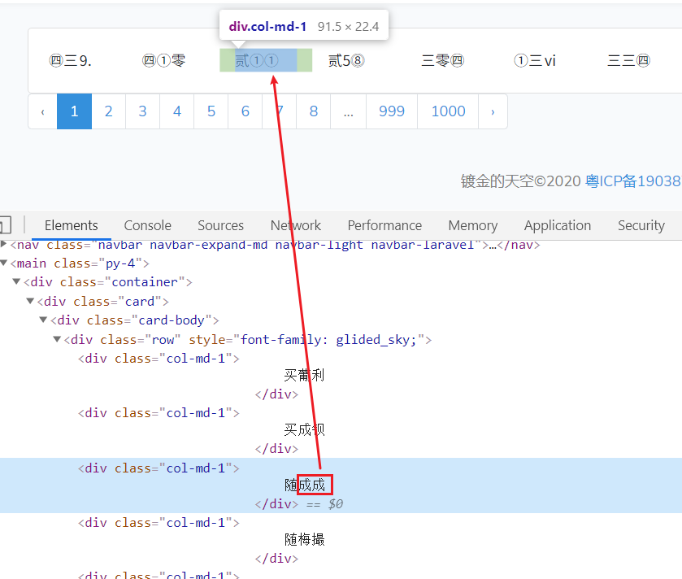

而“成”字对应的unicode编码为“\u6210”，参照cmap中name的值，我们在xml中搜索“uni6210”。


根据以上2次测试，并根据`字体反爬1`的结果，很明显能看出

```
name = "uni" + "源码汉字的unicode编码 去除\u"
根据这个name对应的ID，再减1，结果就是实际的数字。
```


> 代码逻辑

先根据GlyphOrder构建 {"name1": "id", "name2", "id2"...} 的字典，之后再获取到"源码汉字"，将汉字进行切割后，取每一位的unicode码（就是name），以unicode码为键，从字典中取id，id再减1就是用户看到的数字。

> 代码

```python
from env import Env
import re
import base64
from fontTools.ttLib import TTFont
from lxml import etree
import io


"""
将源码中的汉字转化为真实的数字
    src_str: 如'随成成' --> 211
    uni_map: 源码汉字 --> 真实数字 的映射 {"成": 1, "随": 2, ...}
    返回: 真实数字
"""
def parse_srcstr_realnum(src_str, uni_map):
    arr = []
    for ch in src_str:
        # 每个ch都是一个汉字, 将汉字转为unicode编码, 去除串首的\u即为需要的编码
        uni = ch.encode('unicode-escape').decode()
        code = uni.replace('\\u', '')
        arr.append(uni_map[code])

    return int(''.join(arr))

"""
获取从源码中的汉字到见到的数字的映射
    返回: 当前页响应, name(unicode去除'uni')->真实数字 的映射 如, (response, {'7bd9': '0', '9716': '1', ...})
"""
def get_response_and_unimap(page):
    url = f"http://www.glidedsky.com/level/web/crawler-font-puzzle-2?page={page}"

    response = session.get(url, headers=env.headers)

    base64_str = re.search('base64,(.*?)[)]', response.text).group(1)

    # 解码(base64参数都是unicode编码后的串, 所以str先得encode), 解码针对的是base64_str编码成unicode后的bytes
    data = base64.b64decode(base64_str.encode())

    # 现在的data依旧是unicode编码的bytes类型, 转化为io流, 避免写文件过程
    fio = io.BytesIO(data)
    font = TTFont(fio)
    glyph_order = font.getGlyphOrder()
    # xml中：name->ID映射 {"unicode": "id-1", ...} 注意这里的unicode最好把前缀uni去掉, 并字母小写化
    name_id_map = {}
    # 解析GlyphOrder中的<GlyphID id="" name=""> 并组成 {"unicode1": "see_num1", "unicode2": "see_num2", ...}
    for glyph_name in glyph_order:
        name_id_map[str(glyph_name).replace('uni', '').lower()] = str(font.getGlyphID(glyph_name) - 1)

    print('源码汉字unicode码 -> 可见数字: ', name_id_map)
    return name_id_map, response


"""
获取当前页真实的数字和, 一次请求一页, 一页内的数字 映射不会变的
    page: 第几页数据
"""
def get_page_sum(page):
    uni_map, response = get_response_and_unimap(page)
    # 获取每一个数字框
    html = etree.HTML(response.text)
    div_list = html.xpath('//div[@class="card-body"]//div[@class="col-md-1"]')

    # 每页和
    page_total = 0
    for div in div_list:
        # 一个数字串
        s = str(div.xpath('normalize-space(./text())'))
        # 分别解析, 如'231' -> 231
        page_total += parse_srcstr_realnum(s, uni_map)

    return page_total


env = Env()
env.login()
session = env.session

# 总和
total = 0
# 定义和
for page_num in range(1, 1001):
    total += get_page_sum(page_num)
    print(f'前 {page_num} 页和为 {total}')
```


上面的思路及代码其实有误，会在从 uni_map 中取值的时候会报错(KeyError)。

修改代码为如下，进行调试：

①：出错位置添加try...except

```python
def parse_srcstr_realnum(src_str, uni_map):
    arr = []
    for ch in src_str:
        # 每个ch都是一个汉字, 将汉字转为unicode编码, 去除串首的\u即为需要的编码
        uni = ch.encode('unicode-escape').decode()
        code = uni.replace('\\u', '')
        try:
            arr.append(uni_map[code])
        except Exception as e:
            print(e)

    return int(''.join(arr))
```

②：获取response之后，我们添加将base64写入ttf和xml的过程。（目的是保证出错时我们能查看xml，分析为什么没有对应的unicode编码的name值）

```python
# 解码(base64参数都是unicode编码后的串, 所以str先得encode), 解码针对的是base64_str编码成unicode后的bytes
    data = base64.b64decode(base64_str.encode())
    # 写出为 .ttf
    with open('./font-puzzle-test2/font-puzzle-2.ttf', 'wb') as f:
        f.write(data)
    # 将font-puzzle-2.ttf转为xml文件
    font = TTFont('./font-puzzle-test2/font-puzzle-2.ttf')
    font.saveXML('./font-puzzle-test2/font-puzzle-2.xml')

    # 现在的data依旧是unicode编码的bytes类型, 转化为io流, 避免写文件过程
    fio = io.BytesIO(data)
    font = TTFont(fio)
    glyph_order = font.getGlyphOrder()
```

开始调试：

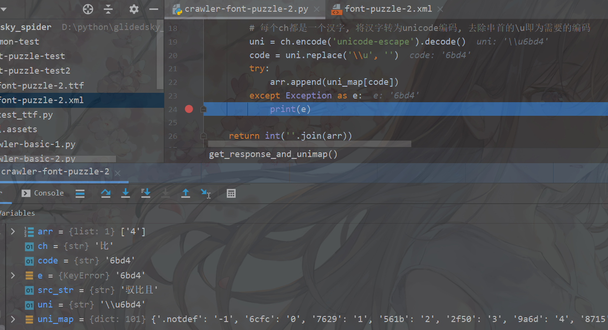

这时数据已经刷新到ttf、xml文件中了，我们进xml文件进行查看：


最后需要特别注意的是：

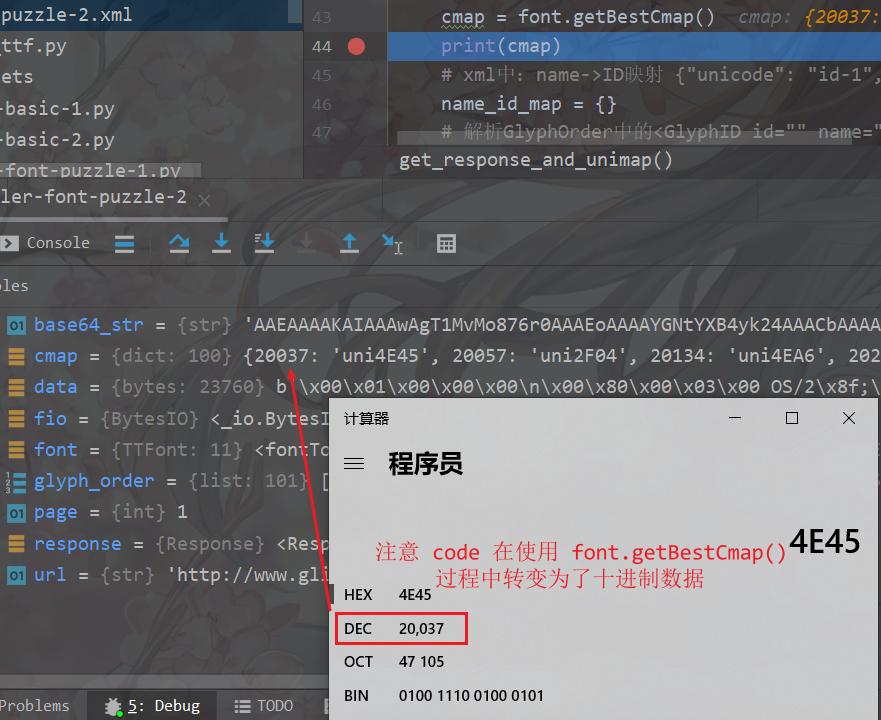

> 修改后的代码

```python
from env import Env
import re
import base64
from fontTools.ttLib import TTFont
from lxml import etree
import io


"""
将源码中的汉字转化为真实的数字
    src_str: 如'随成成' --> 211
    uni_map: 源码汉字 --> 真实数字 的映射 {"成": 1, "随": 2, ...}
    返回: 真实数字
"""
def parse_srcstr_realnum(src_str, uni_map):
    arr = []
    for ch in src_str:
        # 每个ch都是一个汉字, 将汉字转为unicode编码, 去除串首的\u即为需要的编码
        uni = ch.encode('unicode-escape').decode()
        code = uni.replace('\\u', '')
        arr.append(uni_map[code])

    return int(''.join(arr))

"""
获取从源码中的汉字到见到的数字的映射
    返回: 当前页响应, name(unicode去除'uni')->真实数字 的映射 如, (response, {'7bd9': '0', '9716': '1', ...})
"""
def get_response_and_unimap(page):
    url = f"http://www.glidedsky.com/level/web/crawler-font-puzzle-2?page={page}"

    response = session.get(url, headers=env.headers)

    base64_str = re.search('base64,(.*?)[)]', response.text).group(1)

    # 解码(base64参数都是unicode编码后的串, 所以str先得encode), 解码针对的是base64_str编码成unicode后的bytes
    data = base64.b64decode(base64_str.encode())

    # 现在的data依旧是unicode编码的bytes类型, 转化为io流, 避免写文件过程
    fio = io.BytesIO(data)
    font = TTFont(fio)
    glyph_order = font.getGlyphOrder()
    # cmap的结构 { code: name, ... }  注意: cmap中的code是10进制
    cmap = font.getBestCmap()
    name_id_map = {}
    # 解析GlyphOrder中的<GlyphID id="" name=""> 并组成 { "name": "id-1"... }
    for glyph_name in glyph_order:
        # 现在还只是 name: id 映射
        name_id_map[glyph_name] = str(font.getGlyphID(glyph_name) - 1)
    # 定义 code_id_map {code: id, ...}
    code_id_map = {}
    # 遍历cmap, 得到 code_ip_map {code: id}
    for code in cmap:
        # 将code转化为16进制
        code_id_map[hex(code).replace('0x', '')] = name_id_map[cmap[code]]

    print('源码汉字unicode码 -> 可见数字: ', code_id_map)
    return code_id_map, response


"""
获取当前页真实的数字和, 一次请求一页, 一页内的数字 映射不会变的
    page: 第几页数据
"""
def get_page_sum(page):
    uni_map, response = get_response_and_unimap(page)
    # 获取每一个数字框
    html = etree.HTML(response.text)
    div_list = html.xpath('//div[@class="card-body"]//div[@class="col-md-1"]')

    # 每页和
    page_total = 0
    for div in div_list:
        # 一个数字串
        s = str(div.xpath('normalize-space(./text())'))
        # 分别解析, 如'231' -> 231
        page_total += parse_srcstr_realnum(s, uni_map)

    return page_total


env = Env()
env.login()
session = env.session

# 总和
total = 0
# 定义和
for page_num in range(1, 1001):
    total += get_page_sum(page_num)
    print(f'前 {page_num} 页和为 {total}')
```


# 7.CSS反爬-1

每次刷新class都会重置，挑其中一次分析，每次分析的时候的css都要匹配本次显示的页面。


> 以下分析有错！①可以选择不看，直接看错误分析 + 重新讨论。②选择看错误的分类讨论，看下如何犯错的。

```markdown
# 分类讨论(取了少数几个例子):

  ## div.col-md-1 内只有一个div(::before) 直接获取content即为具体内容
	.Lg20BXy { float:left } .Lg20BXy:before { content:"256" } .Lg20BXy { letter-spacing:0.4em }

  ## div.col-md-1 内有4个div 有1个div的class为透明 如源码中为 9 6 7 2  实际显示为 276
	9: .mk0GYspY { float:left } .mk0GYspY { width:1em } .mk0GYspY { margin-right:-1em }   .mk0GYspY { opacity:0 }
	6: .kXr1Xjjpn { position:relative } .kXr1Xjjpn { float:left } .kXr1Xjjpn { width:1em } .kXr1Xjjpn { left:2em }
	7: .Miuk2yGt { float:left }  .Miuk2yGt { width:1em }
	2: .sX3iaG { position:relative } .sX3iaG { float:left } .sX3iaG { width:1em } .sX3iaG { left:-2em }
  规律：顺序遍历, left:2em > 0 就在''末尾插入, left:-2em < 0 就在 ''开头插入, 不存在'left:'和'opacity:0', 就直接保持''末尾插入

  ## div.col-md-1 内有3个div(正常情况) 如源码中为 2 9 4  实际显示为294, 这种直接提取即可
	2: .pRwyq22qBP { float:left } .pRwyq22qBP { width:1em }
	9: .fyM23XHiCE { float:left } .fyM23XHiCE { width:1em }
	4: .BTYOy24xKA { float:left } .BTYOy24xKA { width:1em }
  规律: 按照第二种情况即可（相当于第二种情况中: 所有数字都是 7 ）

  ## div.col-md-1 内有2个div 有一个div**包含数字**但会设置完全透明，另一个div使用::before添加content, 这个div的情况就和第1种情况相同了
```

综上，①和④可以合并为，div.col-md-1内部只要有div.xpath('./div/text()')为空值，那么这个div内部就必定是使用了伪元素选择器，我们就能直接获取content。

②和③也可以合并：②不管透明的那个元素后，就变为了③这种情况了。

至于生成的style直接从源码的<style>中获取即可，用正则验证具体的值存不存在。


>  之前考虑有错😭，例子太片面，下意识认为是“子绝父相”，以倍数获取自生位置，实际错误很大！！！！！！。

看以下例子：

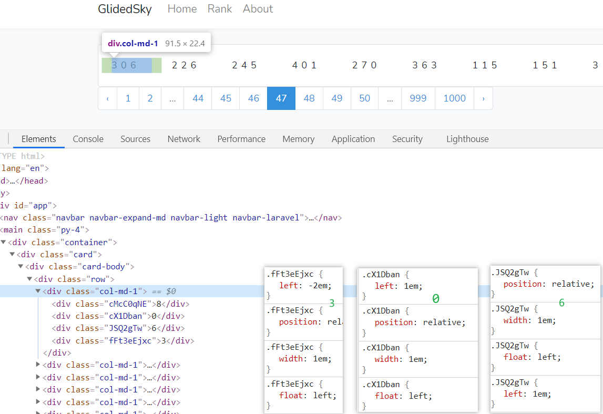

现在才认识到相对定位的问题。


现在开始重新分析：

1. 首先得认识到，div包含四个子div和包含三个子div是相同的，区别仅是它存在`margin-right`和`opacity`的区别（个人觉得等同于：display: none;），只不过得==注意==这个透明元素的位置，本题中一直都是处于div的第一个，所以不会影响到==之后三个div个顺序排列==。

   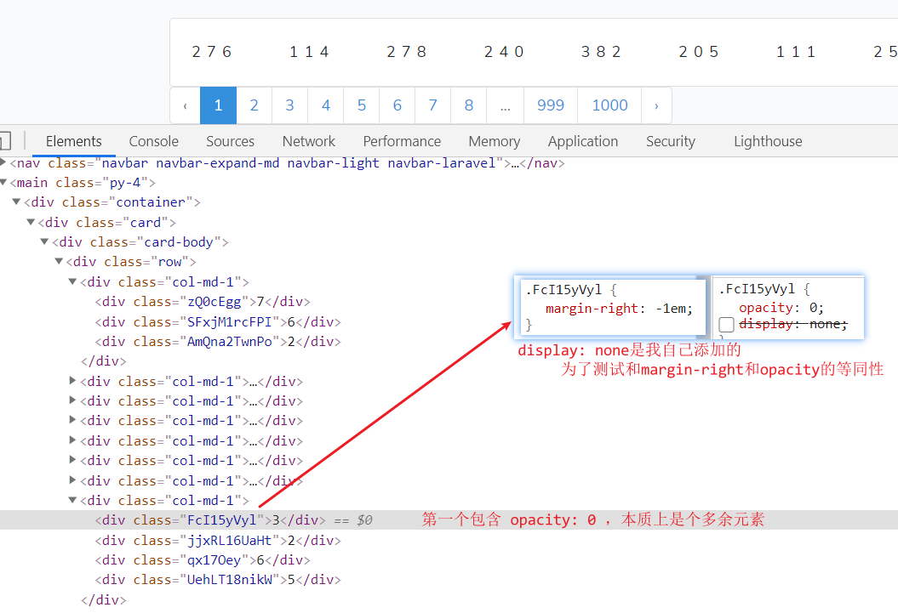

   

2. 还发现有的div，有position: relative，有的div没有。

   这是都有的：

   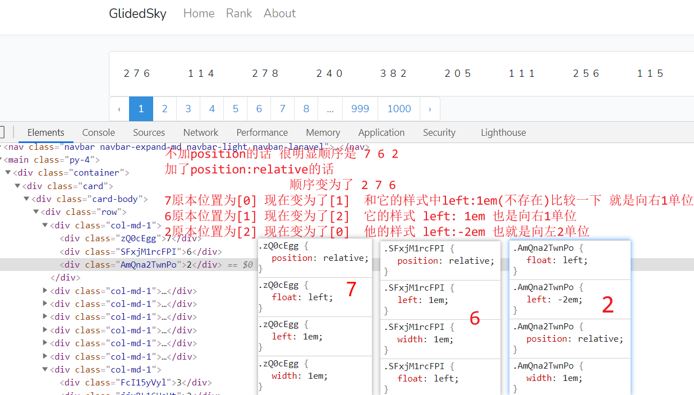

   这是存在没有的：

   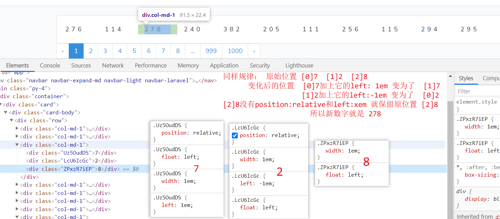

   现在可以看出：div.col-md-1的孩子div的顺序就是原始顺序，这个顺序加上position: relative; left: xem 之后，就变为了新顺序，当然，这个过程中，不存在position: relative 样式的就保留原位置。


3. 孩子为4个div的同理，第一个div因为是隐形的，当作没看见即可，同样也当3个div处理，==但是==，在隐形元素之后位置的元素得位置得提前一个。（如果它之前有2个隐形元素，那么它的index也得提前2，这才是最初排除隐形元素之后，该元素应该在的位置）。

4. 伪元素选择器情况：


==补充==：过程中报错，之后还发现了值div.col-md-1的孩子存在2个的情况，都是有效数字，请注意。

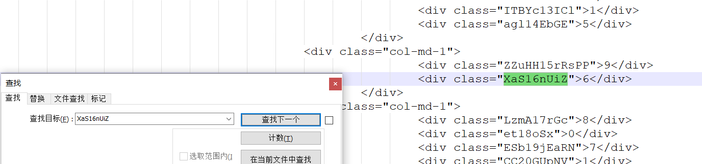

> 修正代码

```python
"""
css反爬-1
"""
from env import Env
import re
from lxml import etree

env = Env()
env.login()
session = env.session

"""
判断一个元素是否为透明元素
    clazz: 该div的class
    style: 页面总style层叠样式表
"""
def is_opacity(clazz, style):
    opacity = re.search(clazz + ' \\{ opacity:0 \\}', style)
    return opacity is not None


"""
解析 div.col-md-1 这个div, 返回真实数据(的字符串形式)
"""
def parse_div(div, style, test_text):
    children = div.xpath('./div')
    # 伪元素选择器情况: 因为页面每个div中都是要么包含一个数字、要么为空值, 所以xpath('text()')得到的结果的列表长度无非就是 0或1, 0表示没有内容
    for index, child in enumerate(children):
        # 长度为0 说明这个div就是 <div>::before</div>
        if len(child.xpath('./text()')) == 0:
            # 从style样式表中将 child 这个div的class值对应的 content 给取出来  如: UFihK6LyIh:before { content:"240" } 将240找出
            return re.search(child.attrib['class'] + ':before \\{ content:"(\\d+)" \\}', style).group(1)

    # 接下来是孩子有3/4个的处理 注意: 在隐形元素之后出现的div元素它的index都得减去它之前隐形元素出现的个数, 才是该div的初始位置
    opacity_count = 0
    # res装最终结果 最多之支持4位数字
    res = [-1, -1, -1, -1]
    # index能记录当前div在源码中的索引
    for index, child in enumerate(children):
        # 类名
        clazz = child.attrib['class']

        # 判断当前元素是否为透明元素
        if is_opacity(clazz, style):
            opacity_count += 1
            continue

        # 非透明元素, 先看是否有position: relative
        relative = re.search(clazz + ' \\{ position:relative \\}', style)

        # 当前div的值
        val = child.xpath('./text()')[0]
        # 不存在的话定位, 就是原位置, 但是得刨去隐藏元素站的位置
        if relative is None:
            res[index - opacity_count] = val
        else:
            # 存在定位就使用当前index加上left:xem 的值, 先获取left:xem  注意search (:?)
            offset = re.search(clazz + ' \\{ left:(-?\\d)em \\}', style).group(1)
            res[index + int(offset) - opacity_count] = val

    # try:
    r = ''.join([i for i in res if i != -1])
    # except Exception as e:
    #     print(e)
    return r


"""
获取每一页数字和
"""
def get_page_sum(page_num):
    url = f"http://www.glidedsky.com/level/web/crawler-css-puzzle-1?page={page_num}"
    response = session.get(url, headers=env.headers)
    html = etree.HTML(response.text)

    div_list = html.xpath('//div[@class="card-body"]//div[@class="col-md-1"]')
    # 浏览器中生成的样式
    style = html.xpath('normalize-space(//style/text())')
    # 每页和
    page_total = 0
    for div in div_list:
        # 解析div
        page_total += int(parse_div(div, style, response.text))
    return page_total


# 总和
total = 0
# 定义和
for page_num in range(1, 1001):
    total += get_page_sum(page_num)
    print(f'前 {page_num} 页和为 {total}')

```


# 8.雪碧图反爬-1

页面结构全是 `div.col-md-1` 中包含2/3个div，class都是随机串 + ' sprite'， 而'sprite'这个样式的`background-image: url()`包含base64串。

多刷新几次网页可以发现每次雪碧图中每个数字大小有差异，那么它==background-position-x==的值就有一定差异，可以观察到同一个数字偏移的'x'值相同，并且因为原图片中数字都是从左到右从小到大排列的，我们可以获取当前页所有携带'sprite'样式的div，每一个div都有一个随机的class，如 'qaz' 它的position-x为-12，'wsx'它的position-x为-23，'edc'的postion-x为0。

```json
{
    "qaz": -12,
    "wsx": -23,
    "edc": 0
}
↓
[ ("qaz", -12), ("wsx", -23), ("edc", 0) ]

d_order = sorted(字典.items(),key=lambda x:x[1],reverse=True)
或者
列表.sort(key=lambda x:x[1], reverse=True)  # 这个列表是上面 ↓ 的那个
```

将值进行顺序排列，得到

```json
[ "edc", "qaz", "wsx" ]
或者
[ ("edc", 0), ("qaz", -12), ("wsx", -23) ]
```

那么接下来再顺序解析每个div时，就能根据它的**class**拿到对应的**数字**了。


> 顺序排列取索引为数字的思维出了点问题，因为之前只注意到了相同数字的 postion-x 是相同的，但是没注意到尽管 position-x 想通了，但是它们的 class 依旧不是同一个！！！


重新考虑如下结构（==qaz==和==rfv==肯定都代表一个数字，只是class不同）：

```json
{
    "qaz": -12,
    "wsx": -23,
    "edc": 0,
    "rfv", -12
}
```

我们直接构建上述字典即可。

这种搜索position-x逆序排列，有个巨大漏：

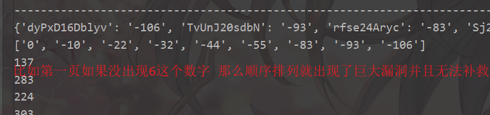


> 错误代码

```python
"""
爬虫-雪碧图-1
"""
from env import Env
from lxml import etree
import re

# 调用封装的登陆环境
env = Env()
session = env.login()

"""
源码中通过解析style, 返回
返回值1: { "qaz": "-12", "wsx": "0", "rfv": "-12", ...}
返回值2: [ "0", "-12" ]
"""
def get_clazzs_num_dict(style):
    # res结构如下: [('fDn6AFGqT', '-23'), ('brq23DUc', '-36'), ...]
    class_num_dict = re.findall('.([0-9a-zA-Z]+) { background-position-x:(-?\\d+)px }', style)
    class_num_dict = dict(class_num_dict)

    # 对num逆序排序
    # 先去重
    offset_list = list(set(class_num_dict.values()))
    # 再根据offset数值进行排序
    offset_list.sort(key=lambda item: int(item), reverse=True)

    print(class_num_dict)
    print(offset_list)

    return class_num_dict, offset_list


"""
获取每一页数字和
"""
def get_page_sum(page_num):
    url = f"http://www.glidedsky.com/level/web/crawler-sprite-image-1?page={page_num}"
    response = session.get(url, headers=env.headers)
    # 获取每一个数字框
    html = etree.HTML(response.text)
    div_list = html.xpath('//div[@class="card-body"]//div[@class="col-md-1"]')

    print('-'*100)
    print(response.text)
    print('-'*100)

    # css样式表字符串
    style = html.xpath('normalize-space(//style/text())')
    # 得到 class -> num 的字典
    clazz_num_dict, offset_list = get_clazzs_num_dict(style)
    # 每页和
    page_total = 0
    for div_col in div_list:
        # 一个div.col-md-1内有length个子div(即数字是length位数)
        length = len(div_col)
        one = 0
        for i in range(0, length):
            # 如class="Fp0PceYg sprite" 应该只要Fp0PceYg
            clazz = div_col[i].attrib['class']
            clazz = clazz[:clazz.index(' ')]
            # clazz_num_dict 中, 键为class, 值为offset
            offset = clazz_num_dict[clazz]
            # 百位乘100 十位乘10 个位乘1
            one += offset_list.index(offset) * pow(10, length-i-1)

        # 加这一个数
        print(one)
        page_total += one

    return page_total


# 总和
total = 0
# 定义和
# for page_num in range(1, 1001):
for page_num in range(1, 2):
    total += get_page_sum(page_num)
    print(f'前 {page_num} 页和为 {total}')
```


> 所以说明：之前的思路全部有问题，参考网上解法后，发现还是得均匀切割图片划分横向10个坐标范围，分别表示[0 ,9]，
>
> 这里能取巧就是将 `|position-x| * 10 / 整个图片横向宽度` 取整即为数字,注意取最接近的整数(如3.2取3, 3.8取4)

这个算式依旧存在问题,因为不同的单位数字还存在一个不同的宽度！！！！


以上这个方法是默认图片中一串数字划分比较整齐采用的估算形式，实际并不准确。

> 下面参考大佬（github搜索==glidedsky_turboway==）的像素法，竖线扫描判断黑白，以此划分出每个数字坐标范围。

个人分析：

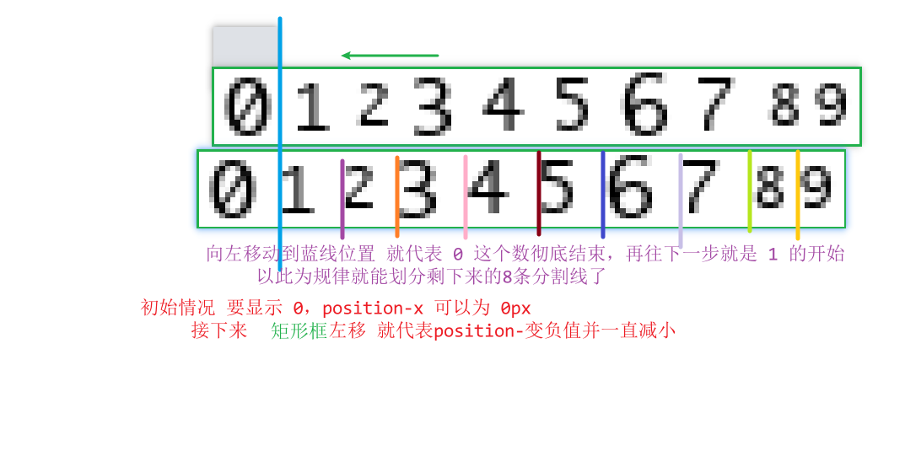

将断点形成列表（长度为11，包括开始、结尾），那么每顺序2个列表元素就能形成10个区间，那么真实的数字就和这个列表的索引产生联系了。

重点在于如何扫描分割：遍历横坐标，循环内遍历纵坐标，遍历纵坐标过程出现黑点即表示当前的横坐标就是`数字的开始`（除0以外，因为 0 总是从 position-x: 0px 开始的）。

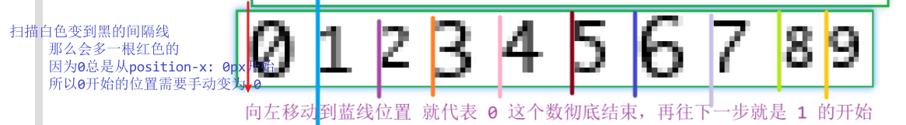

如此能得到10个position-x的值，列表追加一个图片宽度即为结果，就合成为总的包含10个区间的判定列表。


之前的划分方式有错，应该在0结束的时候就开始分隔，因为此时0已经不会再出现了。

结合页面分析：0偏移为 ==-7== 时，

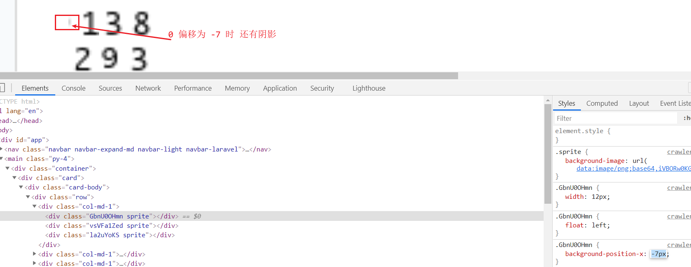

0偏移为 ==-8==时，就已经消失，0都已经消失了，也就不可能算在0的范围内了。

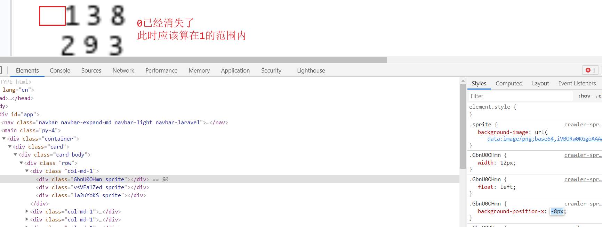


所以应当按下面这种方法划分。


```python
"""
爬虫-雪碧图-1
"""
from env import Env
from lxml import etree
import re
from PIL import Image
import base64
import io

# 调用封装的登陆环境
env = Env()
session = env.login()


"""
生成分隔列表
    如: [-1, 8, 19, 31, 43, 54, 66, 79, 93, 104, 117]
"""
def get_split_list(style):
    split = []
    # 获取图片的尺寸
    base64_bytes = base64.b64decode(re.search('base64,(.*?)\"', style).group(1))
    fio = io.BytesIO(base64_bytes)
    img = Image.open(fio)
    # 获取像素集
    pixels = img.load()
    # 前一列上 全白
    last_x_all_white = True
    # x 表示从左到右
    for x in range(img.width):
        # 当前列全为白色
        current_x_all_white = True
        # y 表示从上到下
        for y in range(img.height):
            # print(f'{x,y}: ', pixels[x, y])
            # rgb和等于255*3, 则为白色, 不等则不为白色
            if sum(pixels[x, y][:3]) != 255 * 3:
                # 当前列存在 非白色
                current_x_all_white = False
                break

        # 一列结束 若current_x_all_white还为True 那么说明当前列全为白色
        if current_x_all_white:
            # 当前列全白色, 并且上一列存在黑
            if not last_x_all_white:
                split.append(x)

        # 进行下一列之前 last_x_all_white就得根据当前列重新赋值
        last_x_all_white = current_x_all_white

    # 开头插入-1 因为只记录了0的结束 没有记录开始
    split.insert(0, -1)
    # 赋值最后一个为图片宽度
    split[len(split) - 1] = img.width

    return split


"""
源码中通过解析style, 构建 class -> offset 
返回值结构: { "qaz": '-12', "wsx": '0', "rfv": '-12', ...}
"""
def get_clazzs_num_dict(style):
    # findall结构如下: [('qaz', '-12'), ('wsx', '0'), ('rfv': '-12') ...]
    # 使用dict构建如下字典 { "qaz": "-12", "wsx": "0", "rfv": "-12", ...}
    class_num_dict = dict(re.findall('.([0-9a-zA-Z]+) { background-position-x:(-?\\d+)px }', style))
    # 将值转为int 并取绝对值
    for _ in class_num_dict:
        class_num_dict[_] = abs(int(class_num_dict[_]))
    return class_num_dict


"""
获取每一页数字和
"""
def get_page_sum(page_num):
    url = f"http://www.glidedsky.com/level/web/crawler-sprite-image-1?page={page_num}"
    response = session.get(url, headers=env.headers)
    # 获取每一个数字框
    html = etree.HTML(response.text)
    div_list = html.xpath('//div[@class="card-body"]//div[@class="col-md-1"]')

    # css样式表字符串
    style = html.xpath('normalize-space(//style/text())')
    # 得到 class -> offset 的字典
    class_num_dict = get_clazzs_num_dict(style)
    # 得到分隔列表
    split_list = get_split_list(style)
    # 每页和
    page_total = 0
    for div_col in div_list:
        # 一个数包含多少位
        length = len(div_col)
        num = 0
        for _ in range(0, length):
            # 如class="Fp0PceYg sprite" 应该只要Fp0PceYg
            clazz = div_col[_].attrib['class']
            clazz = clazz[:clazz.index(' ')]
            # clazz_num_dict 中, 键为class, 值为偏移
            offset = class_num_dict[clazz]
            # 获得真实数字n
            for index, split in enumerate(split_list):
                # 当offset为0 split为-1 这才能判断成功
                if offset < split:
                    n = index - 1
                    break
            num += n * pow(10, length - _ - 1)

        # 加这一个数, 每页有12个数嘛
        page_total += num

    return page_total


# 总和
total = 0
# 定义和
for page_num in range(1, 1001):
    total += get_page_sum(page_num)
    print(f'前 {page_num} 页和为: {total}')
```


# 9.爬虫-验证码-1

分析：

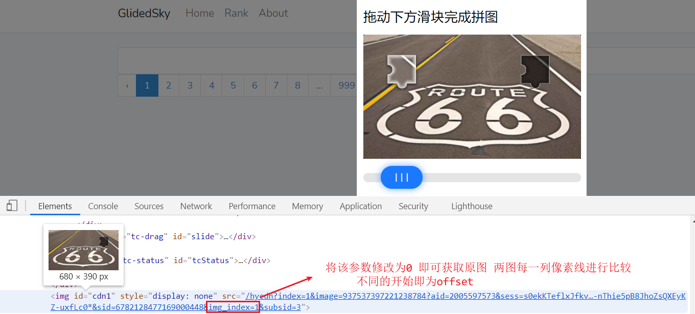


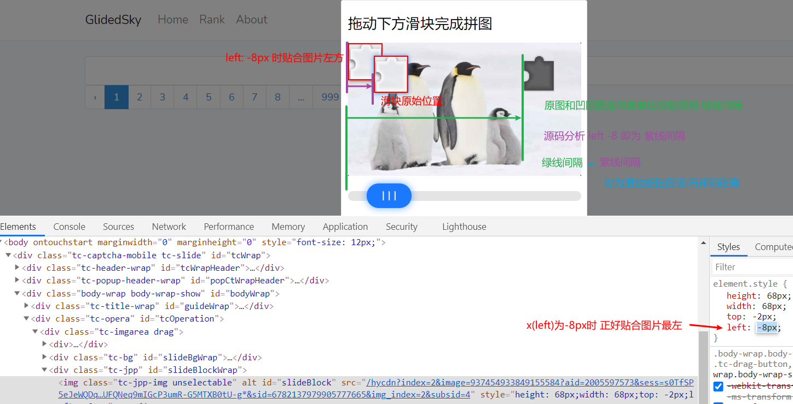


滑动按钮应该右移的距离得到了，直接操作滑动按钮右移，即可完成该滑动验证。

需要注意，验证框是`iframe`标签，需要 ==driver.switch_to.frame(frame_element)==操作。

```python
driver.switch_to.frame(iframe_element) # 转向到该frame中

"""操作frame外边的元素需要切换出去"""
windows = driver.window_handles
driver.switch_to.window(windows[0])
```


注意图片还做了干扰处理：容易看出的有四角、上方

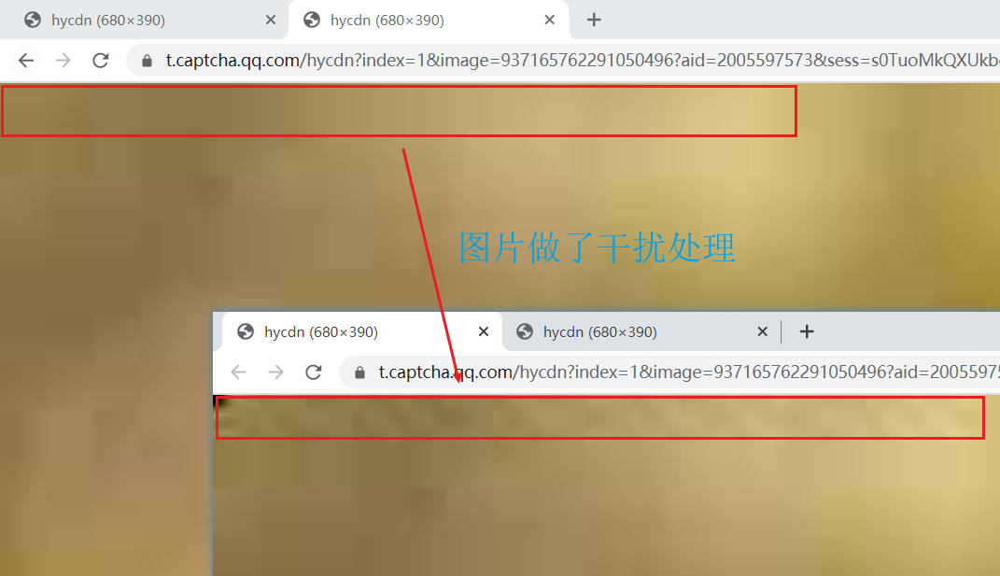

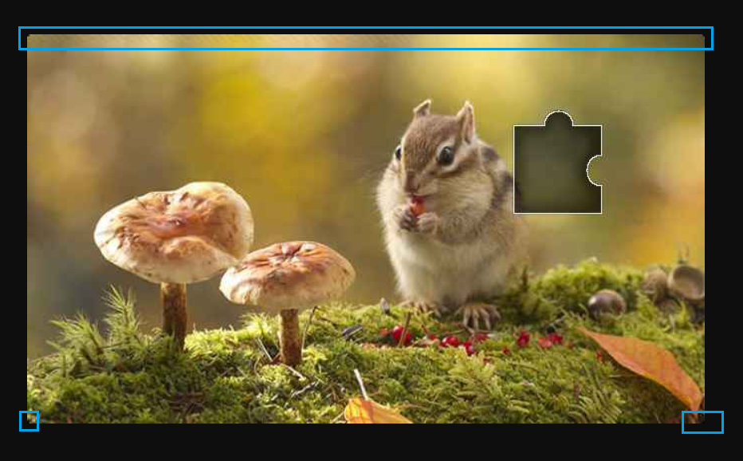


然后就得给个阈值，看一列有多少个不同的像素点以上，才算到了凹陷块。

经过测试：

```
第 0 列像素点差异为 39
第 1 列像素点差异为 40
第 2 列像素点差异为 39
第 3 列像素点差异为 40
第 4 列像素点差异为 39
第 5 列像素点差异为 39
第 6 列像素点差异为 36
第 7 列像素点差异为 26
第 8 列像素点差异为 25
第 9 列像素点差异为 37
.
.
.
第 204 列像素点差异为 23
第 205 列像素点差异为 22
第 206 列像素点差异为 23
第 207 列像素点差异为 51
第 208 列像素点差异为 49
第 209 列像素点差异为 39
第 210 列像素点差异为 41
第 211 列像素点差异为 40
第 212 列像素点差异为 40
第 213 列像素点差异为 38
第 214 列像素点差异为 39

.
.
.
第 399 列像素点差异为 81
第 400 列像素点差异为 61
第 401 列像素点差异为 16
第 402 列像素点差异为 17
第 403 列像素点差异为 16
第 404 列像素点差异为 17
第 405 列像素点差异为 16
第 406 列像素点差异为 17

```

说明整个图片都是做了混淆处理的！！！


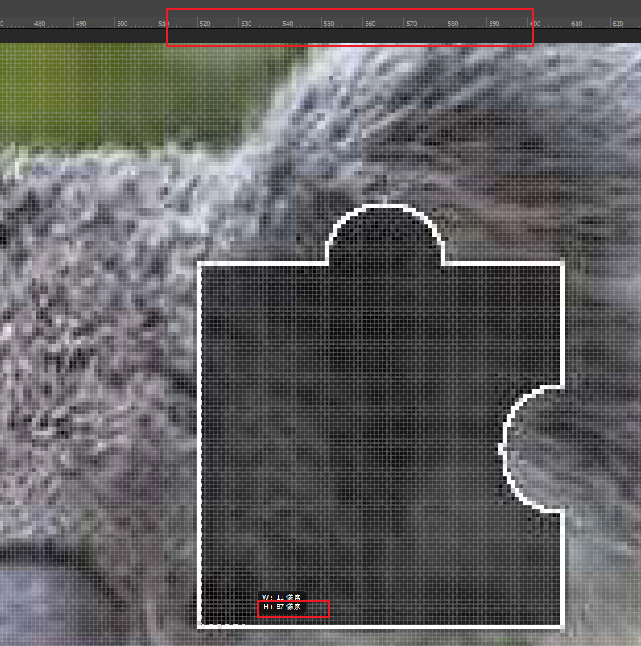

判断缺口的策略：

最开始是打算到了某一列，像素差异个数剧增，并且在接下来10列中保持像素差异点超过100，那么判断这个剧增列就是凹陷图的开始。


> 但是后来发现，不大行！！图片的混淆做的太好了......

后来采用在rgb三个数离（255，255，255）相差都仅小于10，并且一列中有40（因为有时凹陷图左中部有缺口，没缺口的话达到50个应该没问题）个这样的像素点以上，判断这列为凹陷图的开始。

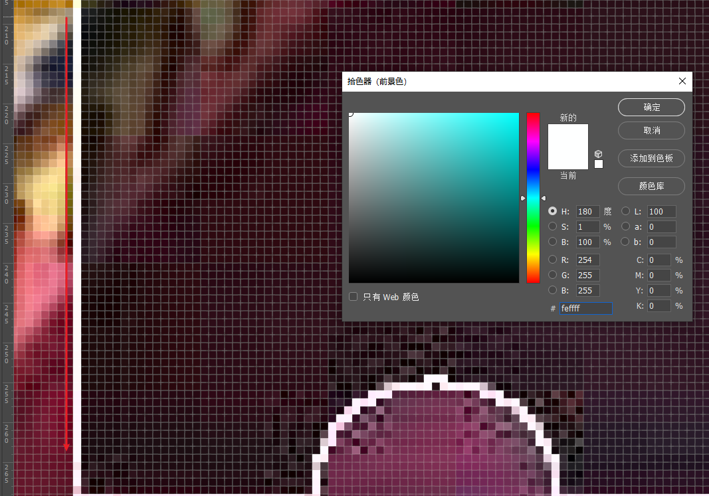

> 后来策略又换成了
>
> 后来采用在rgb三个数离（255，255，255）相差都大于50时，认定这就是凹陷块开始得位置！！！


确定selenium获取的webelement对象的坐标属性时，发现怎么都对不上号，所以才有接下来的测试selenium的location（x和y值）：

调试：

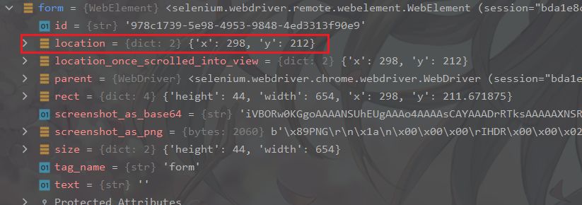

form坐标为（298，212），但是在没调整下面这个设置之前总是对不上号！！！

注意眼观浏览器多宽的时候，一定要把win10显示设置为100%

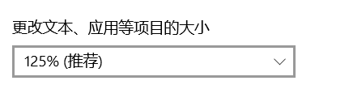

调整之后，能对上号了。

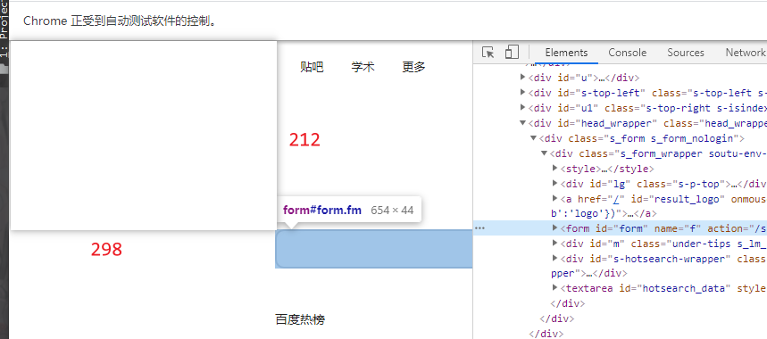


接下来确保代码中测量的距离都是对的，在以上显示设置设置为100%！！！之后进行测量。

滑块位置：x偏移是36

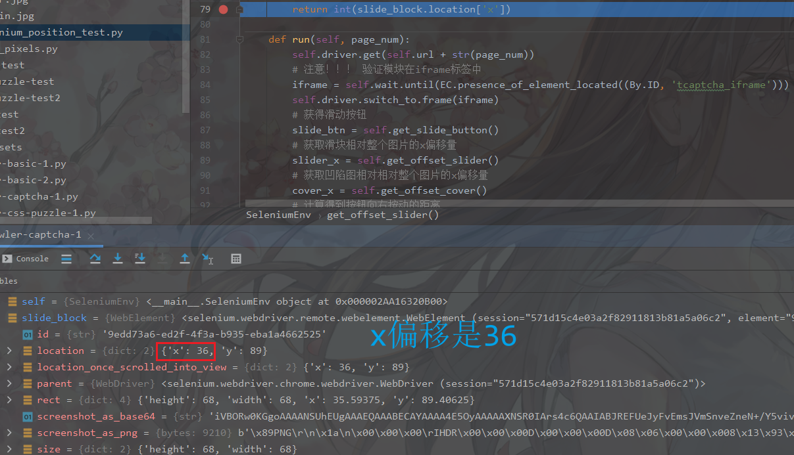

下面是iframe的范围：（图中白色框是我用snipaste截出的 `36*89` 的矩形）

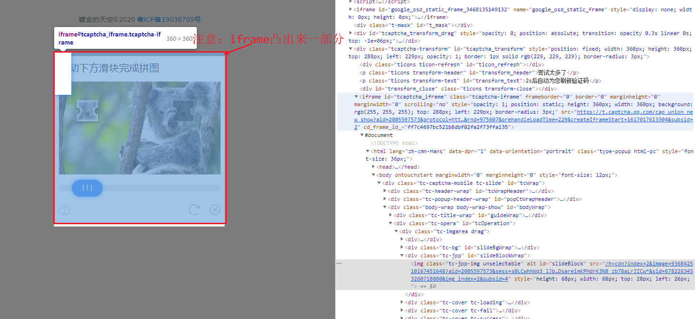

下面是图片的范围：

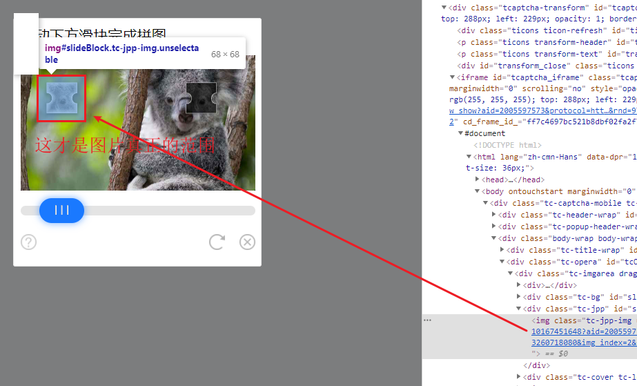


由此，我们得出，在这里得出的location，是相对于iframe本身的！！！

还记得之前分析的这个图？

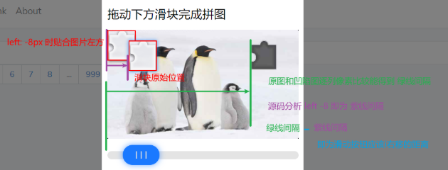

但由于图片还有个透明四周，这个推理要发生变化。

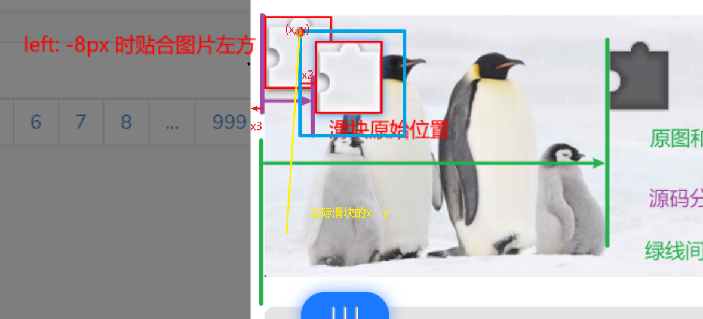


滑块相对图片的偏移应该是：x + x2 - x3

x：图片相对iframe的x

x2：滑块图片的透明四周宽度（大概有11.5）

这里x2它原图是136的，现在浏览器中是68的，原图四周宽度为23，按比例计算，浏览器中四周宽度为：68*23-136=11.5

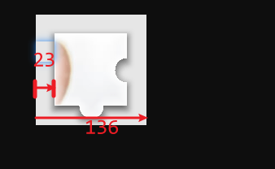

x3：大的验证图片相对iframe有个padding（大概有9.6）

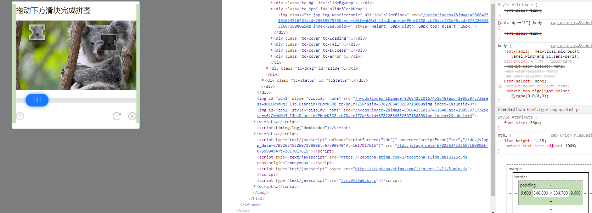


所以，我们拿到滑块的location['x']后直接减2即可。

绿线的距离（就是缺口相对于大图片的x位置）：因为获取的链接的图片，分辨率是实际显示的2倍，所以得到绿线之间的距离还得除以2。


selenium存在点问题，个人修正，不然滑动块移动得很慢！！

```
C:\Users\L\AppData\Local\Programs\Python\Python37\Lib\site-packages\selenium\webdriver\common\actions
```


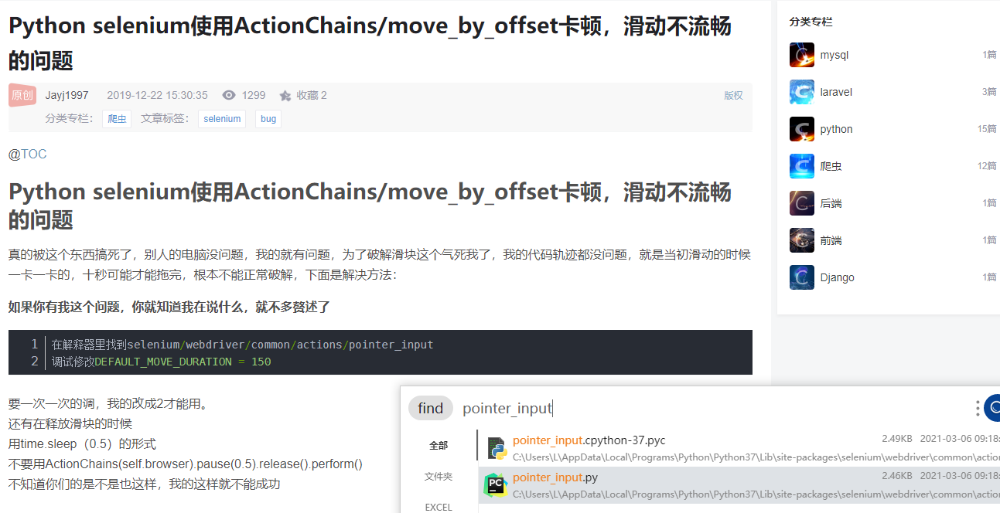


成功的标志：存在 `show-success` 的class的div出现。

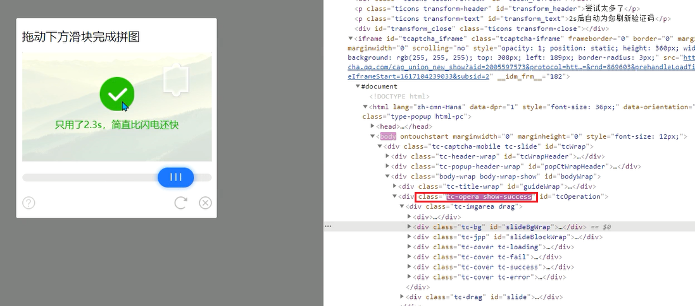


> 代码

```python
"""
爬虫-验证码-1
"""
from selenium import webdriver
from selenium.webdriver import ActionChains
from selenium.webdriver.support.wait import WebDriverWait
from selenium.webdriver.support import expected_conditions as EC
from selenium.webdriver.common.by import By
from PIL import Image
import requests
import io
import time
import random


class SeleniumEnv(object):

    def __init__(self):
        self.driver_path = 'D:\\driver\\89.0\\chromedriver.exe'
        self.url = 'http://www.glidedsky.com/level/web/crawler-captcha-1?page='

        self.driver = webdriver.Chrome(self.driver_path)
        # 参数10表示最长等待10秒, 参数0.5表示0.5秒检查一次规定的标签是否存在
        self.wait = WebDriverWait(self.driver, 2, 0.5)

    # 登陆
    def login(self):
        # 登陆
        self.driver.get("http://www.glidedsky.com/login")
        # 最大化窗口
        self.driver.maximize_window()
        self.driver.find_element_by_id('email').send_keys('ls1229344939@163.com')
        self.driver.find_element_by_id('password').send_keys('密码')
        self.driver.find_element_by_class_name('btn-primary').click()
        time.sleep(1)

    # 获取滑动按钮对象
    def get_slide_button(self):
        time.sleep(1)
        btn = self.driver.find_element_by_id('slideBlock')
        return btn

    # 获得原图和凹陷图的url元组
    def get_origin_cover_image(self):
        time.sleep(1)
        slide_bg = self.driver.find_element_by_id('slideBg')
        # 测试(链接总是为空...)
        # print('slide_bg: ', slide_bg)
        cover_url = slide_bg.get_attribute('src')
        # print('property:', cover_url)
        origin_url = cover_url.replace('img_index=1', 'img_index=0')
        # print('原来: ', origin_url)
        # print('覆盖: ', cover_url)
        return origin_url, cover_url

    # 判断2个像素点 不同返回True
    def point_diff(self, origin_pixel, cover_pixel, threshold):
        return abs(origin_pixel[0] - cover_pixel[0]) > threshold \
               and abs(origin_pixel[1] - cover_pixel[1]) > threshold \
               and abs(origin_pixel[2] - cover_pixel[2]) > threshold

    # 对比原图和凹陷图, 获取凹陷图相对相对整个图片的x偏移量
    def get_offset_cover(self):
        # 分别是原图和凹陷图的url
        origin_url, cover_url = self.get_origin_cover_image()
        # 请求
        origin_img = Image.open(io.BytesIO(requests.get(origin_url).content))
        origin_pixels = origin_img.load()
        # cover_pixels = Image.open(io.BytesIO(requests.get(cover_url).content)).load()
        cover_img = Image.open(io.BytesIO(requests.get(cover_url).content))
        cover_pixels = cover_img.load()

        width = cover_img.width
        height = cover_img.height
        # 原图是680*390 浏览器实际显示有340*195左右 最后偏移要除以2 (680/340)
        # 阈值
        threshold = 50
        # 取巧 因为观察到的结果中 凹陷图在的像素都大于了400像素
        for x in range(350, width):
            for y in range(0, height):
                # 阈值设置为50吧...  r,g,b值都相差50以上
                if self.point_diff(origin_pixels[x, y], cover_pixels[x, y], threshold):
                    # print(f'原图像素点: {origin_pixels[x, y]}, 凹陷图像素点: {cover_pixels[x, y]}')
                    return x / 2

    # 获取滑块相对整个图片的x偏移量
    def get_offset_slider(self):
        time.sleep(1)
        # self.wait.until(EC.presence_of_element_located((By.ID, 'slideBlock')))
        slide_block = self.driver.find_element_by_id('slideBlock')
        # 减2 相关说明看笔记
        slider_x = int(slide_block.location['x']) - 2
        # print(slider_x)
        return slider_x

    """
        验证码验证过程
    """
    def checkout(self, page_num):
        try:
            time.sleep(1)
            self.driver.get(self.url + str(page_num))
            # 注意！！！ 验证模块在iframe标签中
            # 哪个找不到 就在哪个前面加sleep ＞﹏＜
            time.sleep(1)
            # self.wait.until(EC.presence_of_element_located((By.ID, 'tcaptcha_iframe')))
            iframe = self.driver.find_element_by_id('tcaptcha_iframe')
            self.driver.switch_to.frame(iframe)
            # 获得滑动按钮
            slide_btn = self.get_slide_button()
            # 获取滑块相对整个图片的x偏移量
            slider_x = self.get_offset_slider()
            # 获取凹陷图相对相对整个图片的x偏移量
            cover_x = self.get_offset_cover()
            # 计算得到按钮向右按动的距离
            # print(f'cover_x: {cover_x}, slider_x: {slider_x}')
            move_x = cover_x - slider_x
            # print('move_x:', move_x)
            self.move_to_gap(slide_btn, self.get_track(move_x))

            # 用until等太久了
            success = self.wait.until(EC.presence_of_element_located((By.CLASS_NAME, 'show-success')))

            # 返回是否成功校验
            return success is not None
        except Exception as e:
            print(e)
            return False

    # 计算当前页数字和
    def get_total(self):
        # 切出iframe
        windows = self.driver.window_handles
        self.driver.switch_to.window(windows[0])
        div_list = self.driver.find_elements_by_xpath('//div[@class="card-body"]//div[@class="col-md-1"]')

        page_total = 0
        for div in div_list:
            page_total += int(div.text)

        return page_total

    """
       根据偏移量获取移动轨迹
       :param distance: 偏移量
       :return: 移动轨迹
    """
    def get_track(self, distance):
        # 移动轨迹
        track = []
        # 当前位移
        current = 0
        # 减速阈值
        mid = distance * 4 / 5
        # 计算间隔
        t = 0.3
        # 初速度
        v = 0
        while current < distance:
            if current < mid:
                # 加速度为正5
                a = 5
            else:
                # 加速度为负3
                a = -3
            # 当前速度v1 = v0 + at
            v = v + a * t
            # 移动距离x = v0t + 1/2 * a * t^2
            move = v * t + 1 / 2 * a * t * t
            # 当前位移
            current += move
            if current > distance:
                track.append(distance - current + move)
                break
            # 加入轨迹
            track.append(round(move))
            # t时间后, 现在的速度
            v = v + a * t

        # print(f'track: {track}')
        return track

    """
        拖动滑块到缺口处
        :param slider: 滑块
        :param track: 轨迹
        :return:
    """
    def move_to_gap(self, slider, track):
        ActionChains(self.driver).click_and_hold(slider).perform()

        for x in track:
            ActionChains(self.driver).move_by_offset(xoffset=x, yoffset=0).perform()

        time.sleep(random.random())
        ActionChains(self.driver).release().perform()


env = SeleniumEnv()
env.login()

total = 0
# 访问的页数
page = 967

while True:
    sign = env.checkout(page)

    # 如果验证失败
    if not sign:
        fail_count = 1
        print(f'第 {page} 页失败(1)!!!')
        # 重复操作 直到过验证
        while True:
            sign = env.checkout(page)
            if sign:
                print(f'第 {page} 页成功(n)!!!')
                break
            else:
                print(f'第 {page} 页失败(n) 又失败{fail_count}次!!!')
                fail_count += 1
                if fail_count > 3:
                    # 重启浏览器
                    env.driver.quit()
                    env = SeleniumEnv()
                    env.login()
                    fail_count = 0

    else:
        print(f'第 {page} 页成功(1)!!!')
    # 获取当前页和
    # 等数字加载完毕
    time.sleep(1)
    total += env.get_total()

    print(f'前{page}页和为 {total} ')
    page += 1
    if page == 1001:
        env.driver.quit()
        break

"""
中间总有网络原因...有时连页面都打不开 实在加载不出来, 分了多次测, 大概测了10多次吧...
我手动操作都还能一直出现 "网络恍惚了一下"/"拼图块半路丢失"  ???

[1, 272] => 948786 
怎么服务器还能 internal server error(nginx) 啊...
[273, 378) => 368900

T^T
[378, 1000] => 2177686

3495372

怀疑是腾讯防水墙有一定的访问限制, 建议每过100页等个10分钟再爬
"""
```


我靠，页面刷新不出来我能咋办啊？

chrome：

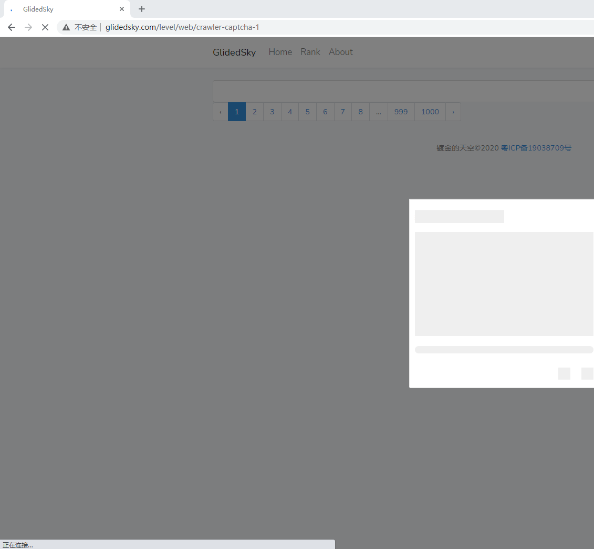


刷新出来了等自己手动操作也出现这种：


# 10.爬虫-JS加密1

> 分析

源码中的响应皆为空串：

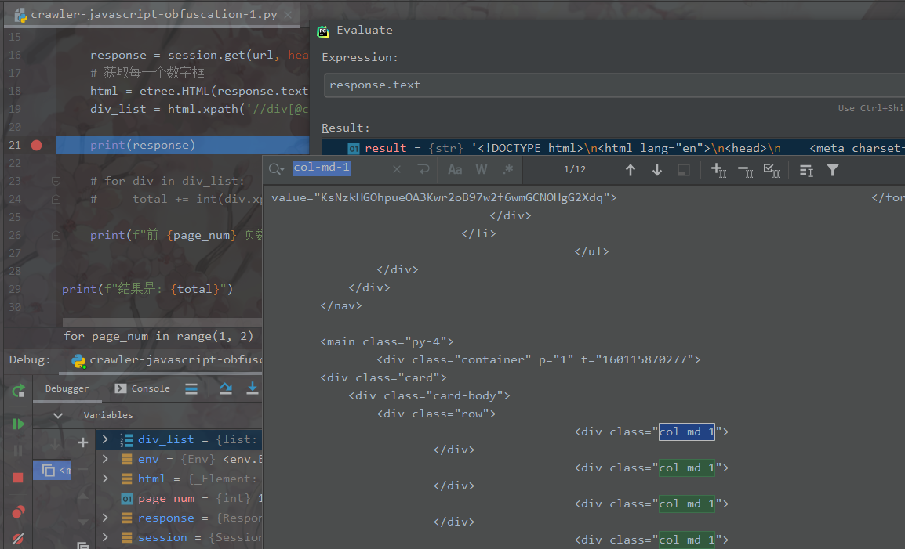


结合页面响应分析：

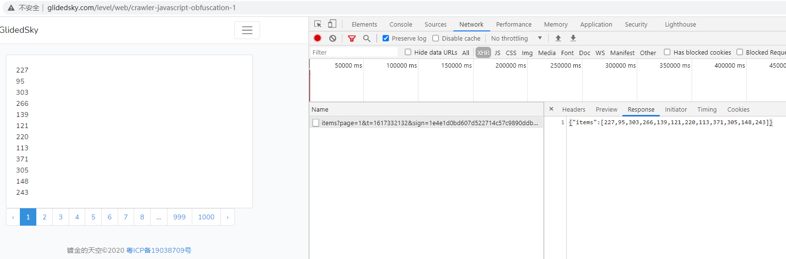

数据应该就是异步加载的了，接下来就是模拟异步GET请求了。


url：

```
http://www.glidedsky.com/api/level/web/crawler-javascript-obfuscation-1/items?page=1&t=1617340189&sign=e7c6b4b333bd07e4753288ca683062e925703341
```

参数分析：

page是页数

t明显是秒级时间戳

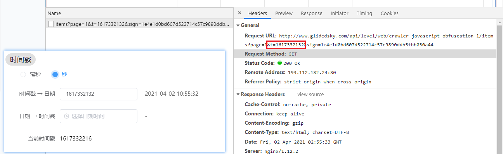

sign就是加密身份验证串了，在源码及响应信息中search不到，并且每次都会变化，那么推测是`本地js生成`。

调试`sha1.js`文件：

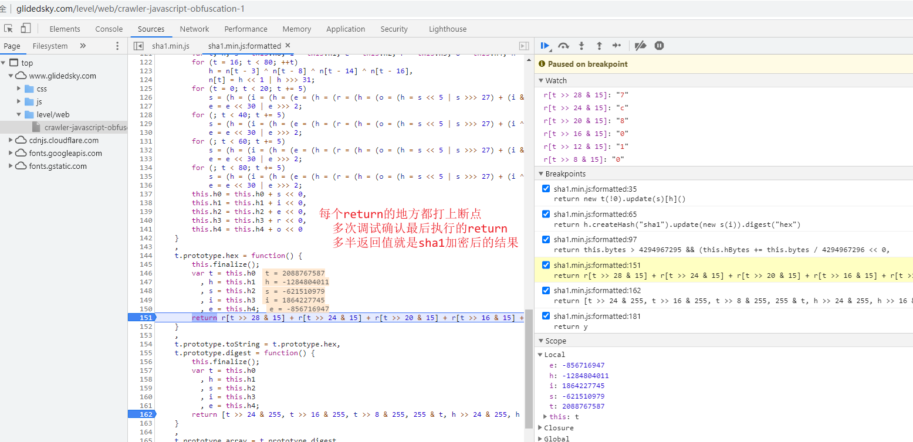

下一步过后，会发现sign的值就是这个return语句返回的结果。

可以比较watch窗口中的值，这里只列举了前几个值，可以看到都是和sign相等的，可以说明这个函数就是生成sign的函数，返回值正好有40项！

```javascript
t.prototype.hex = function() {
        this.finalize();
        var t = this.h0
          , h = this.h1
          , s = this.h2
          , i = this.h3
          , e = this.h4;
        return r[t >> 28 & 15] + r[t >> 24 & 15] + r[t >> 20 & 15] + r[t >> 16 & 15] + r[t >> 12 & 15] + r[t >> 8 & 15] + r[t >> 4 & 15] + r[15 & t] + r[h >> 28 & 15] + r[h >> 24 & 15] + r[h >> 20 & 15] + r[h >> 16 & 15] + r[h >> 12 & 15] + r[h >> 8 & 15] + r[h >> 4 & 15] + r[15 & h] + r[s >> 28 & 15] + r[s >> 24 & 15] + r[s >> 20 & 15] + r[s >> 16 & 15] + r[s >> 12 & 15] + r[s >> 8 & 15] + r[s >> 4 & 15] + r[15 & s] + r[i >> 28 & 15] + r[i >> 24 & 15] + r[i >> 20 & 15] + r[i >> 16 & 15] + r[i >> 12 & 15] + r[i >> 8 & 15] + r[i >> 4 & 15] + r[15 & i] + r[e >> 28 & 15] + r[e >> 24 & 15] + r[e >> 20 & 15] + r[e >> 16 & 15] + r[e >> 12 & 15] + r[e >> 8 & 15] + r[e >> 4 & 15] + r[15 & e]
    }
```


刷新，重新调试，看下一步执行什么：

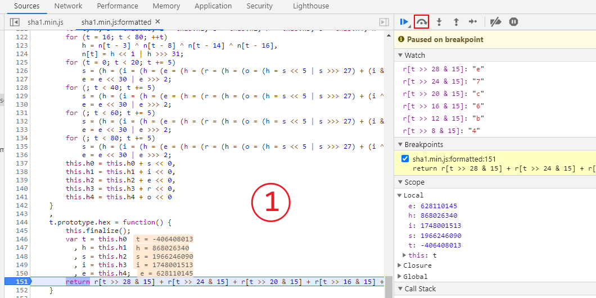

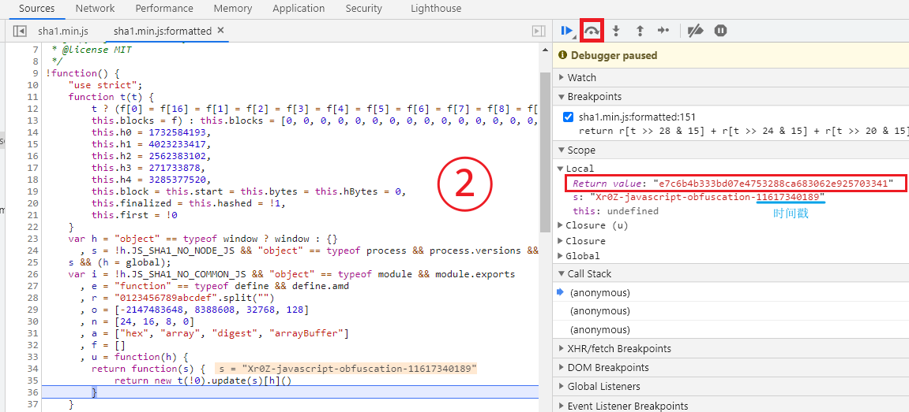

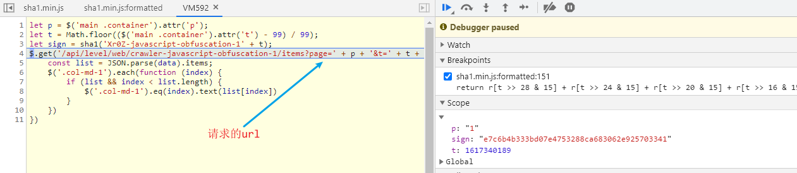


接下来就是如何的到参数`t`和参数`sign`了。

```js
let p = $('main .container').attr('p');
let t = Math.floor(($('main .container').attr('t') - 99) / 99);
let sign = sha1('Xr0Z-javascript-obfuscation-1' + t);
$.get('/api/level/web/crawler-javascript-obfuscation-1/items?page=' + p + '&t=' + t + '&sign=' + sign, function (data) {
    const list = JSON.parse(data).items;
    $('.col-md-1').each(function (index) {
        if (list && index < list.length) {
            $('.col-md-1').eq(index).text(list[index])
        }
    })
})
```

t就是当前的秒级时间戳

```python
time.time()
```

sign得调用sha1的函数：参数是=='Xr0Z-javascript-obfuscation-1' + '时间戳'==，调用方法是：将sha1.js下载下来，采用js2py，用python动态执行js代码。

```python
"""
    js加密-1
"""
from env import Env
import js2py
import math
import time
import json

env = Env()
session = env.login()

# 生成js执行环境
context = js2py.EvalJs()
# python读取js
with open('js-obfuscation-1-test/js/sha1.js', 'r', encoding='utf-8') as f:
    context.execute(f.read())


"""
    获得参数t和sign
"""
def get_t_and_sign():
    # 需要提前定义的参数
    context.t = math.floor(time.time())
    # 需执行js代码
    js = '''
        var sign = sha1('Xr0Z-javascript-obfuscation-1' + t);
    '''
    # 执行js代码
    context.execute(js)
    return context.t, context.sign


# 定义 和
total = 0
for page_num in range(1, 1001):

    t, sign = get_t_and_sign()

    url = f'http://www.glidedsky.com/api/level/web/crawler-javascript-obfuscation-1/items?page={page_num}&t={t}&sign={sign}'

    response = session.get(url, headers=env.headers)

    # print(json.loads(response.text))
    nums = json.loads(response.text)['items']
    total += sum(nums)

    print(f"前 {page_num} 页数字和为: {total}")


print(f"结果是: {total}")
# 这个运行着就很爽了吖 (•ω•`)  舒服
```


# 11.爬虫-验证码-2

页面访问好像没有内容了：http://www.glidedsky.com/level/web/crawler-captcha-2

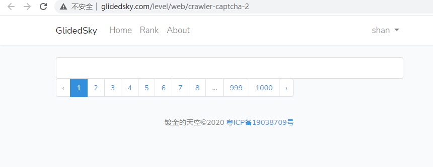

只不过就算做，估计我也没法，猜测都是图形判断或者汉字点击了。


# 12.雪碧图反爬-2

试了下百度识图（每天能免费用很多次），发现依然会有识别出错的情况！！！！

找了个类似的代码，自己修改了部分，能实现训练并识别mnist手写数字：

```python
"""
    tensorflow2.0实现手写汉字实现: http://blog.itpub.net/69978904/viewspace-2733646/
    保存模型: https://www.cnblogs.com/piaodoo/p/14124831.html
    测试tensorflow2实现mnist手写汉字识别
"""
import os

# 一定要放在 import tensorflow 之前才有效 = =
os.environ['TF_CPP_MIN_LOG_LEVEL'] = '2'

from tensorflow import keras
from tensorflow.keras.layers import Flatten, Dense
from tensorflow.keras.datasets import mnist
import numpy as np

# 加载数据集
(train_images, train_labels), (test_images, test_labels) = mnist.load_data()

# 图片每个像素的数值都是在[0, 255]之间，所以归一化要除以255，数据要是浮点数，所以要添加一个小数点
train_images, test_images = train_images / 255.0, test_images / 255.0

"""
    重新创建一个model
"""
def new_model():
    # 定义模型
    # 搭建一个顺序模型，第一层先将数据展平，原始图片是28x28的灰度图，所以输入尺寸是（28，28），第二层节点数可以自己选择一个合适值，这里用128个节点，激活函数用relu
    #   第三层有多少个种类就写多少，[0, 9]一共有10个数字,所以必须写10，激活函数用softmax
    model = keras.Sequential([
        Flatten(input_shape=(28, 28)),
        Dense(128, activation='relu'),
        Dense(10, activation='softmax')
    ])

    # 指定优化器、损失函数、评价指标
    model.compile(optimizer='adam',
                  loss='sparse_categorical_crossentropy',
                  metrics=['acc'])

    return model


"""
    已存在的model, 加载权重和偏置(方法一: 保存模型的权重和偏置)
"""
def load_weights_bias(model):
    if os.path.exists('./tensorflow2_mnist_model/weights_bias_model/checkpoint'):
        model.load_weights('./tensorflow2_mnist_model/weights_bias_model/my_model')
    else:
        print('第一次保存权重和偏置吧? 当前模型文件不存在呐! ')
        return None


"""
    保存model的权重和偏置
"""
def save_weight_bias(model):
    model.save_weights('./tensorflow2_mnist_model/weights_bias_model/my_model')


"""
    训练模型
"""
def train_model(model):
    # 训练模型
    model.fit(train_images, train_labels, epochs=1)


"""
    保存整个模型(方法二: 直接保存整个模型)
"""
def save_all_model(model):
    model.save('./tensorflow2_mnist_model/all_model/mnist_weights.h5')


"""
    加载整个模型
"""
def load_all_model():
    if os.path.exists('./tensorflow2_mnist_model/all_model/mnist_weights.h5'):
        return keras.models.load_model('./tensorflow2_mnist_model/all_model/mnist_weights.h5')
    else:
        print('第一次保存整个模型吧? 当前模型文件不存在呐! ')
        return None


model = new_model()
# 方法一: 开始
# load_weights_bias(model)
# train_model(model)
# save_weight_bias(model)
# 方法一: 结束

# 方法二: 开始
reload_model = load_all_model()
if reload_model is not None:
    model = reload_model

train_model(model)
save_all_model(model)
# 方法二: 结束


# 用测试集验证模型效果
test_loss, test_acc = model.evaluate(test_images, test_labels, verbose=2)
print('Test acc:', test_acc)

# 将图片输入模型，返回预测结果 (将测试集中的第一张图片输入模型)
predictions = model.predict(test_images)
print('predictions: ', predictions)
print('预测值:', np.argmax(predictions[0]))
print('真实值:', test_labels[0])
```


> 先仿照mnist数据集，将glidedsky上的雪碧图分割成每个小的数字，作为训练集图片，之后再读取图片，构成mnist数据集的数据结构，如此达到最终能识别的目的。

## 12.1 思路

训练数据：

在线获取二维雪碧图，用ps切割大的二维雪碧图成小数字图(https://jingyan.baidu.com/article/9989c746fe0ffef649ecfe5d.html)，并批量修改为18*18（**百度**：https://jingyan.baidu.com/article/9f7e7ec0ecf9676f2815540a.html，并且要求为文件名**第一个字母是数字**即可，如'1.12312z.jpg'、'3.(1)jpg'

只不过横向均匀切割还好，但是纵向不行，会打乱数据的完整性，所以最好用代码以像素为基准判断切割好，再用ps统一处理为18*18的训练集（这一步也能用代码完成，所以建议直接用代码下载图片数据集，手动更改文件名作为labels）。


现在只需，将所有18*18图片数据转化为类似mnist的数据结构进行返回：

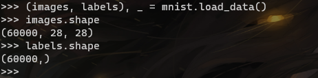

images和labels数据分别是三维和一维Tensor。

然后就能用最上方的训练代码进行训练了。

后续再多弄点数据集。

## 12.2 代码实现切割出小图

横向切割，结果是每一行，没一行内再按照数字最小宽度切割，切出来的图片将分辨率调为18*18就得到了训练图。

批量重命名：左键加上 ctrl ，多选，选好了再右键重命名：

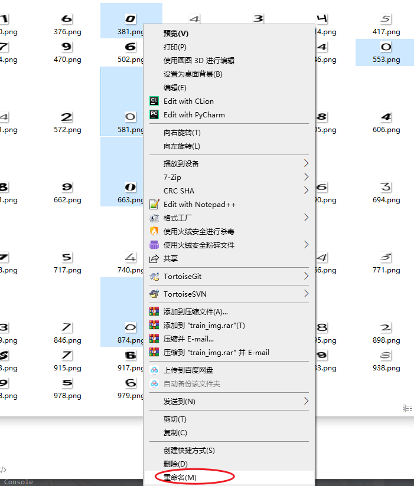

右键重命名，输入“1”，下图即为结果（很方便啊）：


用以下代码多生成写训练集，并批量重命名，有耐心一些。

```python
"""
    下载二维雪碧图并实现分割
"""
from env import Env
import random
import re
from PIL import Image
import base64
import io

# 调用封装的登陆环境
env = Env()
session = env.login()

"""
    获取二维雪碧图
"""
def get_sprite(url):
    # 请求源码
    response = session.get(url, headers=env.headers)

    # 正则解析base64
    base64_bytes = base64.b64decode(re.search('base64,(.*?)\"', response.text).group(1))

    # 可以不用写文件, 直接转为Image
    # with open('./sprite_img/sprite.png', 'wb') as f:
    #     f.write(base64_bytes)

    return Image.open(io.BytesIO(base64_bytes))


"""
    针对每一行的图片进行按列切割, 返回数字的最小宽限集合 如 [(1, 3), (5, 8), ...], 那么横向x 属于 [1, 3] 就是数字0的范围, 一起类推
"""
def get_gray_interval(row_image):
    interval_list = []

    # 前一列纯白 为真
    last_col_all_white = True
    # 数字开始x 和 数字结束x (2个变量不能被重复赋值0, 所以放到循环外部)
    num_start_x = 0
    num_end_x = 0

    # 遍历每一列, 每一行
    pixels = row_image.load()
    for x in range(row_image.width):
        # 当前列纯白为真
        cur_col_all_white = True
        for y in range(row_image.height):
            # 因为是灰度图片 只以 r 值代表颜色即可
            if pixels[x, y][0] != 255:
                cur_col_all_white = False

        # 一列迭代结束后
        # 如果 前一列为全白 and 当前列存在灰
        if last_col_all_white and not cur_col_all_white:
            num_start_x = x
        # 如果 前一列存在灰 and 当前列全白
        if not last_col_all_white and cur_col_all_white:
            num_end_x = x
            # 添加分段信息
            interval_list.append((num_start_x, num_end_x))

        # 下一列开始前, 重置 last_col_all_white
        last_col_all_white = cur_col_all_white

    return interval_list


"""
    切割为合理大小, 保存到train_img文件夹下, 作为训练集
"""
def slice_image(image):
    # 每一块的高
    piece_height = image.height / 10
    # 横向能平均切割, 纵向不能, 用ps横纵平均都是10份试一下就知道了
    # 先纵向平均切割10份 0~9
    for i in range(10):
        y = i * piece_height
        row_image = image.crop((0, y, image.width, y + piece_height))
        # 再对每一行的图片进行按列切割
        interval_list = get_gray_interval(row_image)
        # 遍历分隔 批量分割 保存数字图片
        for interval in interval_list:
            num_image = row_image.crop((interval[0], 0, interval[1], row_image.height))
            # 重置像素为 18*18 NEAREST: 低质量  BILINEAR: 双线性: BICUBIC: 三次样条插值  ANTIALIAS: 高质量  感觉中间两个效果好一些
            num_image = num_image.resize((18, 18), Image.ANTIALIAS)
            # 暂时随机取名 之后再手动调整为真实数字命名文件
            num_image.save(f'./train_img/{random.randint(11, 1000)}.png')


url = 'http://www.glidedsky.com/level/web/crawler-sprite-image-2?page=1'
image = get_sprite(url)
slice_image(image)
```


暂时弄这么多训练集：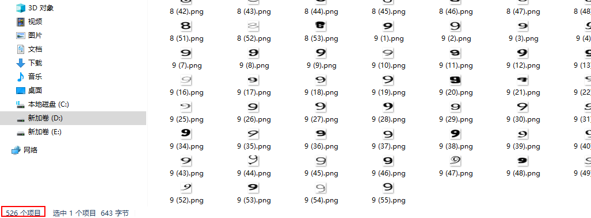

再弄这么多测试集：

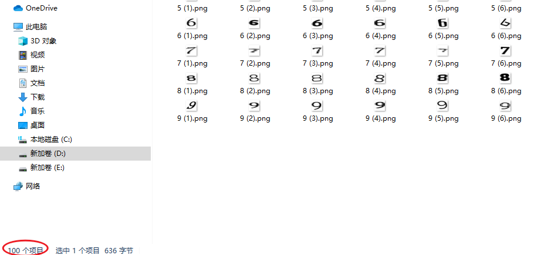


## 12.3 开始训练

读取进去的文件名列表，一定记得shuffle一下。

多训练些数据集，如果对测试结果不满意再重新`添加些训练集`即可。

= =，有些数字形状也太离谱了吧

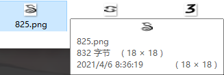


## 12.4 编码

把base64串和预测结果记录，比较，将`不同的数字`保存为训练集，再次训练。

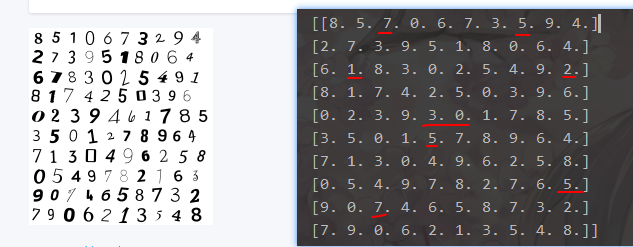

把感觉判断不好的数字也一并加入训练集。

1、2、7、4、6、3是高频错点，都全部加入训练集。

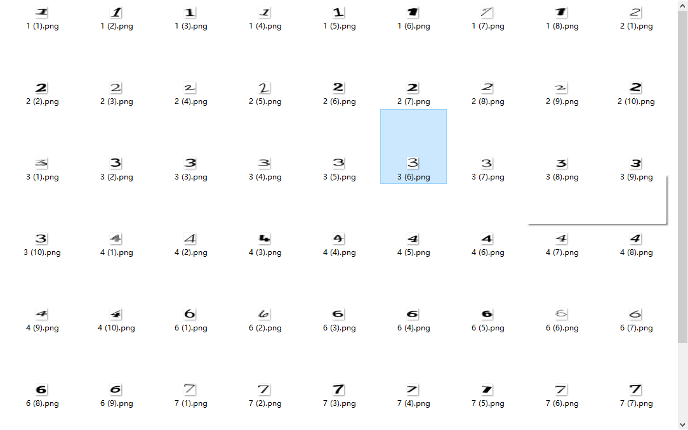


反复重复以上对比操作、添加数据集重新训练操作。

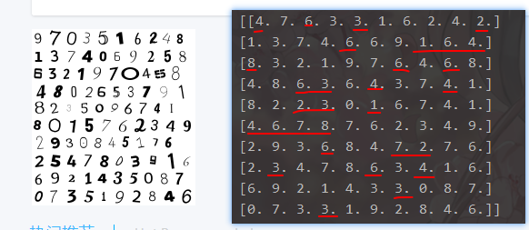

这。。，训练集太少了吧？ = =

再加点：

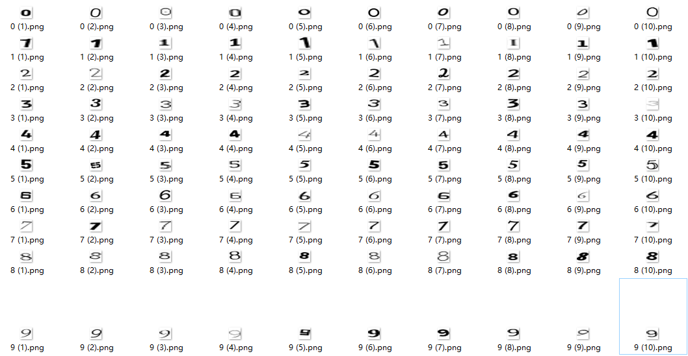

按这样每行10个区分起来会快速些。

接下来就是不断训练的过程了。

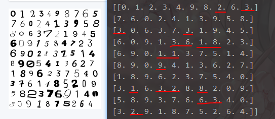

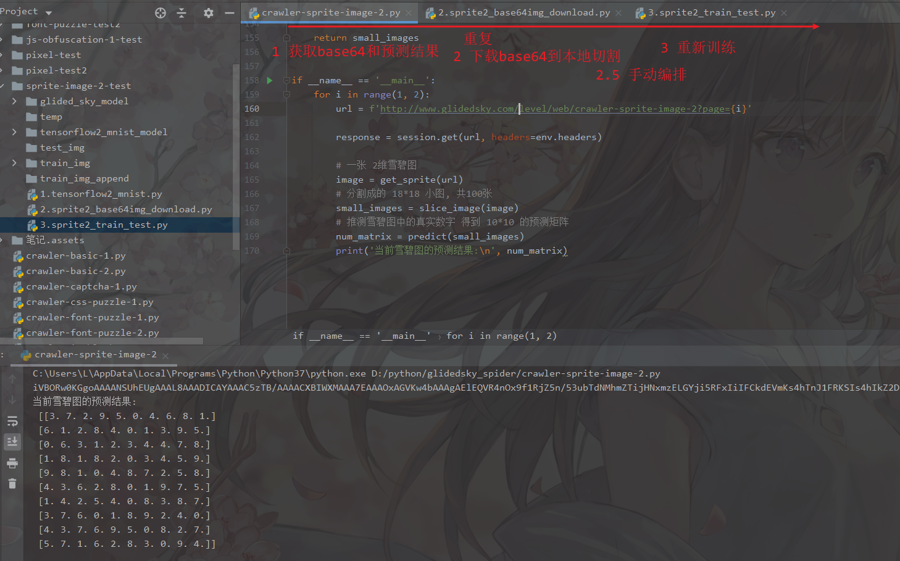


这个 `6`  就离谱

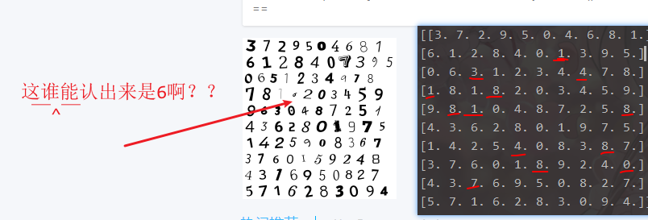


> 之后才意识到，直接获取第一页数据，因为数字固定，能直接获得真实数字和 `small_image` 的对应关系。
>
> https://www.cnblogs.com/TurboWay/p/13678074.html

训练数据：

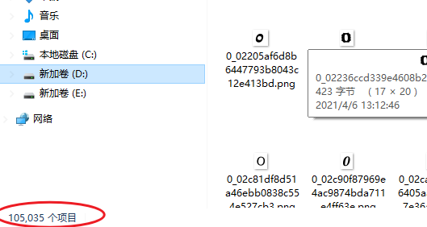

测试数据：

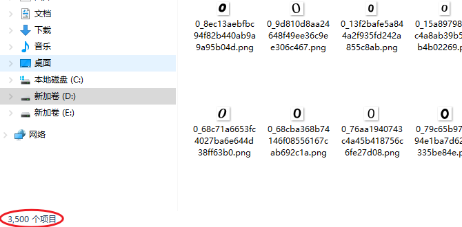

我靠，resize需要重新赋值，没重新赋值就保存了！全是每resize之前的图片，都得重新下载

新数据：

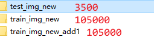

重新训练。

然后每页数据的和，请求次数在3次及其以上，并且有个数频率大于等于3/4，才算请求成功，否则重新请求当前页数据。


> 说明：后续添加训练数据到达42w，应该在10w都够了，我还以为训练出错，多弄了些数据
>
> 还有，即使accuracy达到0.98/0.97（测试集有10w），实际爬取时出错概率依旧特别高，一定要一个页面多请求几组，取高频出现的那个判定数据！！！


> 代码

```python
"""
爬虫-雪碧图-2
"""
import os
os.environ['TF_CPP_MIN_LOG_LEVEL'] = '2'

from env import Env
from lxml import etree
import re
from PIL import Image
import base64
import io
import numpy as np
from tensorflow import keras
import tensorflow as tf

# 调用封装的登陆环境
env = Env()
session = env.login()


"""
    获取二维雪碧图(同 2.sprite2_base64img_download.py)
    context: 网页源码
"""
def get_sprite(context):
    # 正则解析base64
    base64_bytes = base64.b64decode(re.search('base64,(.*?)\"', context).group(1))

    # 可以不用写文件, 直接转为Image
    # with open('./sprite_img/sprite.png', 'wb') as f:
    #     f.write(base64_bytes)

    return Image.open(io.BytesIO(base64_bytes))


"""
    针对每一行的图片进行按列切割, 返回数字的最小宽限集合 如 [(1, 3), (5, 8), ...], 那么横向x 属于 [1, 3] 就是数字0的范围, 一起类推
    (同 2.sprite2_base64img_download.py)
"""
def get_gray_interval(row_image):
    interval_list = []

    # 前一列纯白 为真
    last_col_all_white = True
    # 数字开始x 和 数字结束x (2个变量不能被重复赋值0, 所以放到循环外部)
    num_start_x = 0
    num_end_x = 0

    # 遍历每一列, 每一行
    pixels = row_image.load()
    for x in range(row_image.width):
        # 当前列纯白为真
        cur_col_all_white = True
        for y in range(row_image.height):
            # 因为是灰度图片 只以 r 值代表颜色即可
            if pixels[x, y][0] != 255:
                cur_col_all_white = False

        # 一列迭代结束后
        # 如果 前一列为全白 and 当前列存在灰
        if last_col_all_white and not cur_col_all_white:
            num_start_x = x
        # 如果 前一列存在灰 and 当前列全白
        if not last_col_all_white and cur_col_all_white:
            num_end_x = x
            # 添加分段信息
            interval_list.append((num_start_x, num_end_x))

        # 下一列开始前, 重置 last_col_all_white
        last_col_all_white = cur_col_all_white

    return interval_list


"""
    将图片列表转为类似mnist数据结构的数据, 方便模型进行预测
    return: [100*18*18] 三维矩阵Tensor
        基本同 3.sprite2_train_test.py 中的 def get_train_data_like_mnist(train_img_path)
"""
def parse_images_like_mnist_data(small_images):
    # 准备三维矩阵
    images = np.zeros([len(small_images), 18, 18])

    # 遍历每个像素点
    for index, small_image in enumerate(small_images):
        # 遍历每个图片的所有像素点
        width = 18
        height = 18
        for x in range(0, width):
            for y in range(0, height):
                # 单通道取 r值 即可  构建[b, 18, 20]  保证灰度值在 0~1
                images[index][x][y] = small_image.getpixel((x, y))[0] / 255.0

    # 返回训练数据时, 需要将数据封装为Tensor
    return tf.convert_to_tensor(images, dtype=tf.float32)


"""
    预测数字
    return: 返回数字列表(str形式, 后期方便拼接)
"""
def predict(small_images, model):
    # num表示每一页数据 就是12个
    num_list = []

    images_data = parse_images_like_mnist_data(small_images)
    # 进行预测 predictions 是预测的概率值
    predictions = model.predict(images_data)

    # 预测值填充进 num_list
    for i in range(0, len(small_images)):
        # 将int64转为int
        num_list.append(np.argmax(predictions[i]))

    return num_list


"""
    根据每个单数字div的偏移和宽高从雪碧图中切割出小图, 利用模型识别数字
    image: 二位雪碧图
    context: 网页源码
    return: (切割好的 single_bit_image集合, 一页共12个数每个数有几位数字)
"""
def slice_image(image, context):
    # 每一位数字的集合
    single_bit_images = []
    # 记录总共12个数字 每个数字各有多少位
    count_bit = []

    # 获取装有数字的div
    html = etree.HTML(context)
    num_divs = html.xpath('//div[@class="col-md-1"]')
    # 获取css
    style = html.xpath('//style/text()')[0]

    # 遍历div(一整个数字)
    for num_div in num_divs:
        # 记录这个数字有多少位
        count = 0
        # 遍历每一位数字的每一位
        for single_bit_div in num_div:
            # 获取样式

            clazz = single_bit_div.attrib['class']
            clazz = clazz[:clazz.index(' ')]
            # 从style查询 offset-x offset-y width height
            offset_x = abs(int(re.search(clazz + ' \\{ background-position-x:(-?\\d+)px', style).group(1)))
            offset_y = abs(int(re.search(clazz + ' \\{ background-position-y:(-?\\d+)px', style).group(1)))
            width = abs(int(re.search(clazz + ' \\{ width:(\\d+)px', style).group(1)))
            height = abs(int(re.search(clazz + ' \\{ height:(\\d+)px', style).group(1)))

            # 切割 雪碧图中这个偏移和宽高对应的图片 就是当前数字的图
            single_bit_image = image.crop((offset_x, offset_y, offset_x + width, offset_y + height))

            # resize
            single_bit_image = single_bit_image.resize((18, 18), Image.ANTIALIAS)

            # 加入单位数字
            single_bit_images.append(single_bit_image)
            count += 1

        # 记录下这个数字的位数
        count_bit.append(count)

    return single_bit_images, count_bit


"""
    根据每一个小数字 和 每个大数字占的位数 的到大数字集合
"""
def mix_num(single_num_list, count_bit):
    index = 0
    # 结果
    num_list = []

    for bit in count_bit:
        num = 0
        # 按照位数 顺序拼接每一位 循环次数是bit次
        while bit:
            num += single_num_list[index] * (10 ** (bit - 1))
            index += 1
            bit -= 1

        # 填入
        num_list.append(num)

    return num_list


"""
    请求返回当前页数字集合
"""
def get_num_list(page_num, model):
    url = f'http://www.glidedsky.com/level/web/crawler-sprite-image-2?page={page_num}'

    response = session.get(url, headers=env.headers)

    # 一张 2维雪碧图
    sprite_image = get_sprite(response.text)
    # 分割成的 18*18 小图
    single_bit_images, count_bit = slice_image(sprite_image, response.text)

    # 推测雪碧图中的真实数字 得到数字列表
    num_list = predict(single_bit_images, model)

    # 根据列表和有几位数字获得真实数字集合
    num_list = mix_num(num_list, count_bit)
    # print(f'第 {page_num} 页的每个数字: ', num_list)

    return num_list


"""
    判断预测是否精确
"""
def is_accurate(predicts):
    # = =, 模型判断率挺高的了(都42w训练集了), 同一页请求的前三次都相同直接就返回了(即判定准确结果都还有错) 难道存在连续3次都判错的可能?
    # if len(predicts) < 3:
    if len(predicts) < 6:
        return False

    predicts_set = set(predicts)
    # 看预测结果出现的频率 认定出现频率 >= 2/3 那么这个数才是准确的(因为本身模型确认率虽然接近100% 但不是100%)
    # 统计 { 数字: 出现的次数 }
    statistics = {num: predicts.count(num) for num in predicts_set}

    # 值逆序排列 返回列表 一对键值混合为元组
    statistics = sorted(statistics.items(), key=lambda x: x[1], reverse=True)
    # 值最大的元组 的第二个元素 才是 频数, 元组第一个是数字和
    # 不用这个条件了 = =, 太多预测错误的就会一直卡在当前页了 永远达不到这个比例
    # if statistics[0][1] / len(predicts) >= 3 / 4:

    # 采用 只有频率1出现 or 频率top1 / top2 > n 我觉得4够高了啊
    if len(statistics) == 1 or statistics[0][1] / statistics[1][1] > 4:
        print(statistics)
        return statistics[0][0]
    else:
        return False


if __name__ == '__main__':
    total = 0

    # 模型文件路径
    model_path = './sprite-image-2-test/glided_sky_model/glided_sky_model.h5'
    # 加载模型(放到函数里加载报WARNING, 解决不了: ARNING:tensorflow:6 out of the last 11 calls to <function
    #       Model.make_predict_function.)
    restored_model = keras.models.load_model(model_path)

    for i in range(1, 1001):
        # 当前页的预测值集合
        predicts = []

        print('-' * 100)
        # 结果是否准确
        accurate = is_accurate(predicts)
        count = 0
        while not accurate:
            count += 1
            # 不精确 就重新请求
            num_list = get_num_list(i, restored_model)
            predicts.append(sum(num_list))
            accurate = is_accurate(predicts)

        print(f'经过 {count} 轮计算, 结果才精确!!!')
        # 判断数值是否精确 这里accurate是int64的, 源于用模型预测时 np.argmax() 结果是 int64
        print(f'第 {i} 页数据为: {num_list}, 求和是 {accurate}')

        total += accurate
        print(f'前 {i} 页, 数字和为 {total}')
        print('-' * 100)

"""
    page1 [337, 379, 263, 144, 131, 285, 381, 364, 291, 171, 110, 94]
    page1 + page2 + page3 = 2956 + 2907 + 2844 = 8707
    
    错误答案1: 2725233
    错误答案2: 2724715
    还真是出错出在连续三次都判定为错误答案!!! 修改为6次以上才判定就好了(多判定几组数据) (正确答案: 27247^_^)
    之前还怀疑训练42w组数据都能出错 (*￣▽￣*)
"""
```


